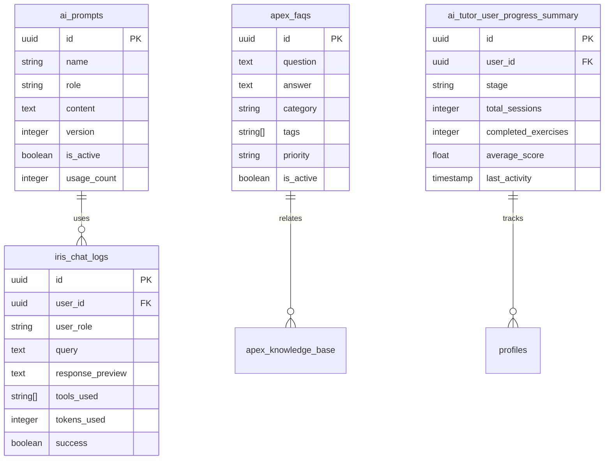

# DIL-LMS Technical Architecture Documentation

## System Overview

DIL-LMS (Digital Interactive Learning - Learning Management System) is a comprehensive educational platform built with modern web technologies. The system supports multi-role access (Students, Teachers, Admins), AI-powered learning features, and multi-tenancy architecture.

### Technology Stack

- **Frontend**: React 18 + TypeScript + Vite
- **UI Framework**: Radix UI + Tailwind CSS + shadcn/ui
- **Backend**: Supabase (PostgreSQL + Edge Functions)
- **Authentication**: Supabase Auth with MFA support
- **AI Integration**: OpenAI GPT-4 + Custom AI Assistants (IRIS, APEX)
- **Real-time Features**: Supabase Realtime + WebSockets
- **File Storage**: Supabase Storage
- **Notifications**: Firebase Cloud Messaging
- **State Management**: React Query + Context API

## System Architecture

## Database Schema Overview

### Core Tables

### AI and Analytics Tables

## Key User Flows

### 1. User Authentication Flow

### 2. AI Assistant (IRIS) Query Flow

### 3. Course Enrollment Flow

### 4. Assignment Submission Flow

### 5. AI Learning Session Flow

### 6. Admin Analytics Dashboard Flow

### 7. Multi-Factor Authentication Setup Flow

### 8. Real-time Notification Flow

## Security Architecture

### Row Level Security (RLS) Implementation

### API Security Flow

## Performance Optimizations

### Caching Strategy

### Database Optimization

## Deployment Architecture

### Infrastructure Overview

### CI/CD Pipeline

## API Documentation

### Core Endpoints

| Endpoint Category | Base Path | Description |
|------------------|-----------|-------------|
| Authentication | `/auth` | User login, registration, MFA |
| User Management | `/api/users` | Profile management, roles |
| Course Management | `/api/courses` | Course CRUD, enrollment |
| Class Management | `/api/classes` | Class creation, student assignment |
| AI Services | `/api/ai` | IRIS, APEX, AI tutoring |
| Analytics | `/api/analytics` | Reports, dashboards, insights |
| File Management | `/storage` | File upload, download, management |
| Notifications | `/api/notifications` | Push notifications, email |

### Edge Functions

| Function | Purpose | Trigger |
|----------|---------|---------|
| `iris-chat` | AI analytics assistant | User query |
| `apex-ai-assistant` | AI support assistant | User question |
| `reports-assistant` | Report generation AI | Analytics request |
| `generate-course-thumbnail` | AI thumbnail generation | Course creation |
| `send-notification` | Push notification dispatch | System events |
| `bulk-upload-users` | Batch user import | Admin action |

## Monitoring and Observability

### System Monitoring

### Logging Strategy

## Scalability Considerations

### Horizontal Scaling

### Performance Bottlenecks

| Component | Potential Bottleneck | Mitigation Strategy |
|-----------|---------------------|-------------------|
| Database | Complex analytics queries | Materialized views, caching |
| AI Services | OpenAI API rate limits | Request queuing, fallbacks |
| File Storage | Large file uploads | Chunked uploads, compression |
| Real-time | WebSocket connections | Connection pooling, clustering |
| Authentication | MFA verification | Async processing, caching |

## Future Enhancements

### Planned Features

1. **Advanced AI Tutoring**
   - Personalized learning paths
   - Adaptive difficulty adjustment
   - Multi-modal learning support

2. **Enhanced Analytics**
   - Predictive analytics
   - Learning outcome prediction
   - Behavioral pattern analysis

3. **Mobile Applications**
   - Native iOS/Android apps
   - Offline learning support
   - Push notification enhancements

4. **Integration Ecosystem**
   - Third-party LMS integration
   - Single Sign-On (SSO)
   - API marketplace

5. **Advanced Security**
   - Zero-trust architecture
   - Advanced threat detection
   - Compliance frameworks (GDPR, COPPA)

### Technical Debt

| Area | Issue | Priority | Timeline |
|------|-------|----------|----------|
| Code Quality | Legacy component refactoring | Medium | Q2 2024 |
| Performance | Database query optimization | High | Q1 2024 |
| Security | Enhanced audit logging | High | Q1 2024 |
| Testing | Increased test coverage | Medium | Q2 2024 |
| Documentation | API documentation completion | Low | Q3 2024 |

---

## Conclusion

The DIL-LMS system represents a modern, scalable educational platform with advanced AI capabilities. The architecture supports multi-tenancy, role-based access control, and real-time collaboration while maintaining high security standards and performance optimization.

The system's modular design allows for future enhancements and integrations while the comprehensive monitoring and observability ensure reliable operation at scale.

For technical questions or contributions, please refer to the development team or create an issue in the project repository.

---

*Last Updated: December 2024*
*Version: 1.0*
*Document Status: Complete*
