# Functional Design Document
## DIL Learning Management System & AI Tutor Platform

---

### **Document Control**

| **Attribute** | **Details** |
|---------------|-------------|
| **Document Title** | Functional Design Document - DIL LMS & AI Tutor Platform |
| **Version** | 1.0.0 |
| **Date** | November 3, 2025 |
| **Status** | Final |
| **Classification** | Internal Use |
| **Owner** | DIL Product Team |
| **Author** | Solutions Architect |
| **Approver** | Technical Lead, Product Owner |

---

### **Revision History**

| **Date** | **Version** | **Author** | **Changes** | **Approver** |
|----------|-------------|------------|-------------|--------------|
| 2025-11-03 | 1.0.0 | Solutions Architect | Initial document creation | Product Owner |
| | | | | |
| | | | | |

---

### **Document Distribution**

| **Role** | **Name** | **Organization** |
|----------|----------|------------------|
| Product Owner | TBD | DIL |
| Technical Lead | TBD | DIL |
| Development Team | TBD | DIL |
| QA Team | TBD | DIL |

---

## **Table of Contents**

1. [Executive Summary](#1-executive-summary)
2. [System Overview](#2-system-overview)
   - 2.1 [Purpose and Scope](#21-purpose-and-scope)
   - 2.2 [System Context](#22-system-context)
   - 2.3 [Key Stakeholders](#23-key-stakeholders)
3. [Functional Requirements](#3-functional-requirements)
   - 3.1 [User Management](#31-user-management)
   - 3.2 [Course Management](#32-course-management)
   - 3.3 [Content Delivery](#33-content-delivery)
   - 3.4 [Assessment & Grading](#34-assessment--grading)
   - 3.5 [AI Tutor](#35-ai-tutor)
   - 3.6 [Communication](#36-communication)
   - 3.7 [Analytics & Reporting](#37-analytics--reporting)
   - 3.8 [Offline Learning](#38-offline-learning)
4. [System Architecture](#4-system-architecture)
   - 4.1 [High-Level Architecture](#41-high-level-architecture)
   - 4.2 [Component Architecture](#42-component-architecture)
   - 4.3 [Data Flow](#43-data-flow)
   - 4.4 [Technology Stack](#44-technology-stack)
5. [Database Design](#5-database-design)
   - 5.1 [Entity Relationship Diagram](#51-entity-relationship-diagram)
   - 5.2 [Key Entities](#52-key-entities)
   - 5.3 [Data Model](#53-data-model)
6. [API Specifications](#6-api-specifications)
   - 6.1 [Authentication APIs](#61-authentication-apis)
   - 6.2 [Course APIs](#62-course-apis)
   - 6.3 [AI Tutor APIs](#63-ai-tutor-apis)
   - 6.4 [Edge Functions](#64-edge-functions)
7. [User Interface Design](#7-user-interface-design)
   - 7.1 [Design Principles](#71-design-principles)
   - 7.2 [User Flows](#72-user-flows)
   - 7.3 [Screen Layouts](#73-screen-layouts)
8. [Security & Compliance](#8-security--compliance)
   - 8.1 [Authentication & Authorization](#81-authentication--authorization)
   - 8.2 [Data Security](#82-data-security)
   - 8.3 [Compliance](#83-compliance)
9. [Integration Points](#9-integration-points)
   - 9.1 [Third-Party Integrations](#91-third-party-integrations)
   - 9.2 [External APIs](#92-external-apis)
10. [Deployment Architecture](#10-deployment-architecture)
    - 10.1 [Infrastructure](#101-infrastructure)
    - 10.2 [CI/CD Pipeline](#102-cicd-pipeline)
    - 10.3 [Environments](#103-environments)
11. [Non-Functional Requirements](#11-non-functional-requirements)
    - 11.1 [Performance](#111-performance)
    - 11.2 [Scalability](#112-scalability)
    - 11.3 [Availability](#113-availability)
    - 11.4 [Maintainability](#114-maintainability)
12. [Appendices](#12-appendices)
    - 12.1 [Glossary](#121-glossary)
    - 12.2 [Assumptions & Constraints](#122-assumptions--constraints)
    - 12.3 [Future Enhancements](#123-future-enhancements)

---

## **1. Executive Summary**

### **1.1 Document Purpose**

This Functional Design Document (FDD) provides a comprehensive technical specification for the DIL (Developments in Literacy) Learning Management System and AI Tutor Platform. It serves as the authoritative reference for system architecture, functional capabilities, technical implementation, and operational requirements.

### **1.2 System Overview**

The DIL LMS is a web-based educational platform designed to deliver CEFR-aligned language learning experiences with integrated AI-powered tutoring. The system supports multiple user roles, offline learning capabilities, real-time collaboration, and comprehensive analytics.

**Key Characteristics:**
- **Platform Type:** Web-based (React SPA)
- **Primary Users:** Students, Teachers, Content Creators, Administrators
- **Core Technologies:** React, TypeScript, Supabase (PostgreSQL), Node.js
- **Deployment:** Cloud-native (AWS)
- **Architecture Pattern:** Microservices with Edge Functions

### **1.3 Business Context**

**Organization:** Developments in Literacy (DIL)  
**Mission:** Transform language learning through intelligent, adaptive technology  
**Target Market:** Educational institutions, language learners globally  
**Unique Value Proposition:** AI-augmented personalized learning with offline capabilities

### **1.4 Key Features Summary**

| **Feature Category** | **Capabilities** |
|---------------------|------------------|
| **User Management** | Role-based access (6 roles), MFA, profile management |
| **Course Management** | Course builder, CEFR alignment, multimedia content |
| **Content Delivery** | Video streaming, interactive exercises, offline access |
| **Assessment** | Quizzes, assignments, auto-grading, rubrics |
| **AI Tutor** | Voice/text chat, contextual assistance, practice generation |
| **Communication** | Messaging, discussions, Zoom integration |
| **Analytics** | Student progress, teacher insights, admin reports |
| **Offline Learning** | Course downloads, local storage, auto-sync |

---

## **2. System Overview**

### **2.1 Purpose and Scope**

#### **2.1.1 System Purpose**

The DIL LMS platform addresses the following business objectives:

1. **Personalized Learning:** Deliver adaptive, CEFR-aligned content tailored to individual proficiency levels
2. **Scalable Education:** Enable institutions to serve thousands of students with minimal overhead
3. **Accessibility:** Provide offline learning capabilities for regions with limited connectivity
4. **AI-Augmented Support:** Offer 24/7 AI tutoring to supplement human instruction
5. **Data-Driven Insights:** Provide actionable analytics for teachers and administrators

#### **2.1.2 Scope**

**In Scope:**
- ✅ Web-based learning platform (responsive design)
- ✅ Six user roles with distinct permissions
- ✅ Course creation, management, and delivery
- ✅ AI-powered tutoring with voice support
- ✅ Offline course downloads and synchronization
- ✅ Real-time messaging and discussions
- ✅ Quiz and assignment management
- ✅ Payment processing (Stripe)
- ✅ Zoom meeting integration
- ✅ Comprehensive analytics and reporting
- ✅ Multi-tenancy support

**Out of Scope:**
- ❌ Native mobile applications (iOS/Android)
- ❌ Single Sign-On (SSO) integration
- ❌ SCORM/xAPI content packages
- ❌ Certificate generation
- ❌ SMS notifications
- ❌ Full UI internationalization (AI Tutor supports multiple languages)

### **2.2 System Context**

#### **2.2.1 System Context Diagram**

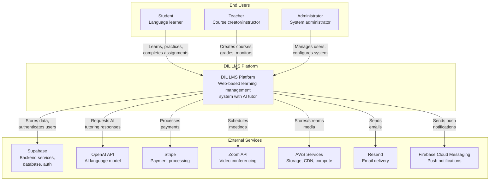

**Figure 2.1: System Context Diagram - DIL LMS Platform**

#### **2.2.2 External Interfaces**

| **External System** | **Interface Type** | **Purpose** | **Protocol** |
|---------------------|-------------------|-------------|--------------|
| Supabase | REST API, PostgreSQL | Database, Auth, Storage | HTTPS, PostgreSQL |
| OpenAI API | REST API | AI Tutor responses | HTTPS |
| Stripe | REST API, Webhooks | Payment processing | HTTPS |
| Zoom | REST API, OAuth | Video meetings | HTTPS |
| AWS S3 | S3 API | Media storage | HTTPS |
| AWS CloudFront | CDN | Content delivery | HTTPS |
| Resend | REST API | Email delivery | HTTPS |
| Firebase | REST API | Push notifications | HTTPS |

### **2.3 Key Stakeholders**

| **Stakeholder** | **Role** | **Responsibilities** | **Success Criteria** |
|-----------------|----------|---------------------|---------------------|
| **Students** | End User | Learn, complete assignments, interact with AI tutor | Course completion, skill improvement |
| **Teachers** | Content Creator | Create courses, grade assignments, monitor progress | Student success, course effectiveness |
| **Content Creators** | Content Manager | Curate learning materials, maintain content quality | Content accuracy, engagement |
| **Admins** | System Manager | Manage users, configure system, ensure compliance | System uptime, user satisfaction |
| **Super Users** | System Administrator | Full system access, technical configuration | System health, security |
| **View Only Users** | Observer | Read-only access to content | Information access |
| **Product Owner** | Business Lead | Define requirements, prioritize features | ROI, user adoption |
| **Development Team** | Builder | Implement features, maintain system | Code quality, delivery speed |

---

## **3. Functional Requirements**

### **3.1 User Management**

#### **3.1.1 User Roles**

**FR-UM-001: Role-Based Access Control**
- **Priority:** P0 (Critical)
- **Description:** System SHALL support six distinct user roles with granular permissions
- **Roles:**
  1. **Student:** Access courses, submit assignments, use AI tutor
  2. **Teacher:** Create courses, grade, view analytics
  3. **Content Creator:** Create/edit content, cannot delete courses
  4. **Admin:** Manage users, configure system, approve content
  5. **Super User:** Full system access (limited to ONE per system)
  6. **View Only:** Read-only access to content

**Traceability:**
- Implementation: `src/config/roleNavigation.ts`, `NEW_USER_ROLES_IMPLEMENTATION.md`
- Database: `supabase/migrations/20251028000000_add_new_user_roles.sql`

#### **3.1.2 Authentication**

**FR-UM-002: Email/Password Authentication**
- **Priority:** P0 (Critical)
- **Description:** Users SHALL authenticate using email and password
- **Requirements:**
  - Email verification required
  - Password minimum: 12 characters, uppercase, lowercase, number, symbol
  - Account lockout after 5 failed attempts
  - Password reset via email (1-hour expiry)

**FR-UM-003: Multi-Factor Authentication (MFA)**
- **Priority:** P1 (High)
- **Description:** System SHALL support TOTP-based MFA
- **Requirements:**
  - Optional for all users
  - TOTP algorithm (RFC 6238)
  - 6-digit codes, 30-second validity
  - Backup codes generation
  - MFA enforcement capability per admin

**Traceability:**
- Implementation: `src/services/supabaseMFAService.ts`, `src/components/auth/`

#### **3.1.3 User Profile Management**

**FR-UM-004: Profile Data**
- **Priority:** P1 (High)
- **Description:** Users SHALL maintain profile with required and optional fields
- **Required Fields:**
  - First Name, Last Name
  - Email (verified)
  - User Role
  - Institution/School
- **Optional Fields:**
  - Profile Photo (JPG/PNG, max 5 MB)
  - Date of Birth
  - Learning Goals
  - Native Language
  - CEFR Level
  - Time Zone

**Traceability:**
- Database: `profiles` table in `supabase/migrations/`

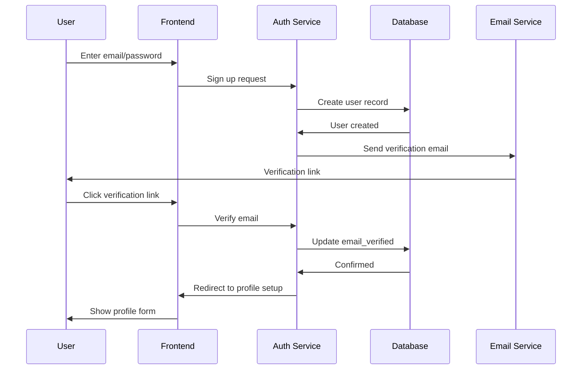

### **3.2 Course Management**

#### **3.2.1 Course Creation**

**FR-CM-001: Course Builder**
- **Priority:** P0 (Critical)
- **Description:** Teachers/Admins SHALL create courses with hierarchical structure
- **Structure:**
  ```
  Course
  ├── Sections (modules)
  │   ├── Lessons
  │   │   ├── Content Items
  │   │   │   ├── Video
  │   │   │   ├── Text
  │   │   │   ├── Quiz
  │   │   │   ├── Assignment
  │   │   │   └── Attachment
  ```
- **Course Metadata:**
  - Title, description, subtitle
  - Thumbnail image
  - CEFR level (A1-C2)
  - Category
  - Status (Draft, Under Review, Published)
  - Payment type (Free, Paid)
  - Course price (if paid)

**FR-CM-002: Content Types**
- **Priority:** P0 (Critical)
- **Description:** System SHALL support multiple content types
- **Supported Types:**
  1. **Video:** MP4 upload, YouTube/Vimeo embed, adaptive streaming
  2. **Text:** Rich text with formatting, images, embedded files
  3. **Quiz:** Multiple choice, fill-in-blank, drag-drop, math questions
  4. **Assignment:** File upload, text submission, rubric-based grading
  5. **Attachment:** PDFs, documents (max 50 MB)

**Traceability:**
- Implementation: `src/pages/CourseBuilder.tsx`, `src/components/course/`
- Database: `courses`, `course_sections`, `course_lessons`, `course_lesson_content` tables

#### **3.2.2 Course Enrollment**

**FR-CM-003: Enrollment Methods**
- **Priority:** P0 (Critical)
- **Description:** Students SHALL enroll via multiple methods
- **Methods:**
  1. **Direct Enrollment:** Browse catalog, click "Enroll"
  2. **Invitation:** Teacher/Admin invites specific students
  3. **Payment:** Purchase via Stripe checkout

**FR-CM-004: Payment Processing**
- **Priority:** P1 (High)
- **Description:** System SHALL process payments for paid courses
- **Requirements:**
  - Stripe integration
  - Checkout session creation
  - Webhook handling
  - Automatic enrollment on successful payment
  - Payment status tracking

**Traceability:**
- Implementation: `supabase/functions/create-checkout-session/`, `supabase/functions/stripe-webhook/`
- Database: `course_payments`, `course_members` tables

### **3.3 Content Delivery**

#### **3.3.1 Lesson Player**

**FR-CD-001: Lesson Interface**
- **Priority:** P0 (Critical)
- **Description:** Students SHALL access lessons through unified player interface
- **Features:**
  - Sequential or flexible navigation
  - Progress tracking (per content item)
  - Bookmark capability
  - Note-taking
  - AI Tutor integration (floating widget)

**FR-CD-002: Video Playback**
- **Priority:** P0 (Critical)
- **Description:** System SHALL stream videos with adaptive quality
- **Requirements:**
  - HLS adaptive streaming
  - Signed URLs (security)
  - Playback speed control
  - Progress tracking
  - Auto-resume from last position

**Traceability:**
- Implementation: `src/pages/CourseContent.tsx`

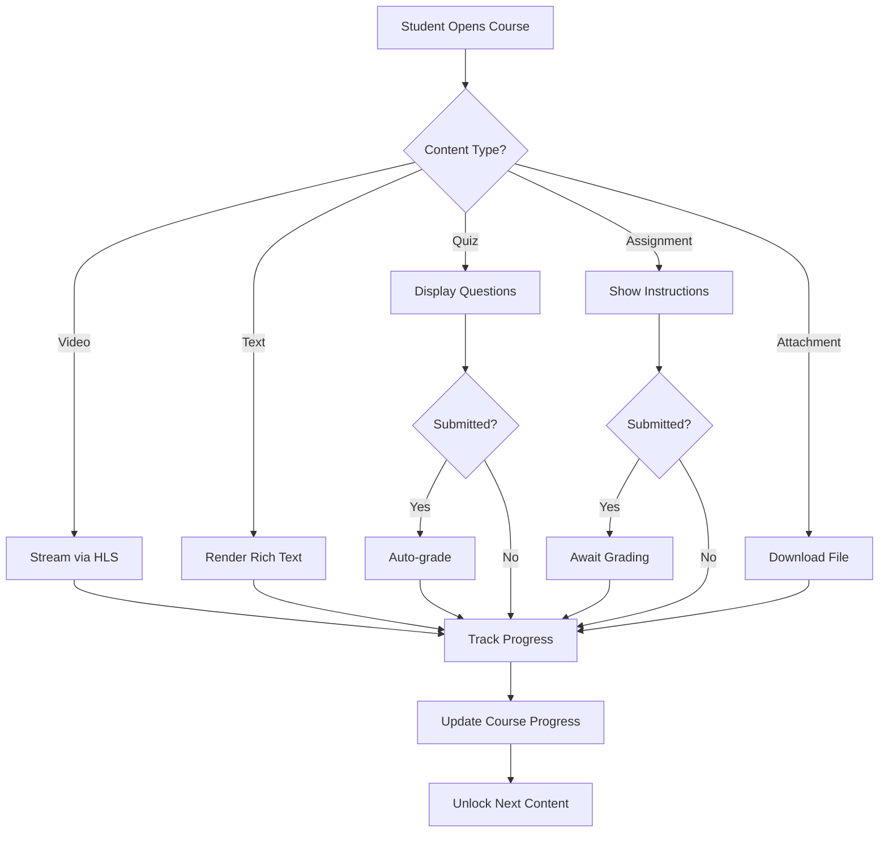

### **3.4 Assessment & Grading**

#### **3.4.1 Quiz Management**

**FR-AG-001: Quiz Creation**
- **Priority:** P0 (Critical)
- **Description:** Teachers SHALL create quizzes with multiple question types
- **Question Types:**
  1. Multiple Choice (single/multiple answers)
  2. True/False
  3. Fill-in-the-blank
  4. Drag-and-drop matching
  5. Math expressions (with tolerance)
  6. Image-based questions

**FR-AG-002: Auto-Grading**
- **Priority:** P1 (High)
- **Description:** System SHALL automatically grade supported question types
- **Requirements:**
  - Immediate feedback
  - Points calculation
  - Partial credit support
  - Attempt tracking
  - Grade recording

**Traceability:**
- Implementation: Quiz rendering in `src/pages/CourseContent.tsx`
- Database: `quiz_questions`, `question_options`, `quiz_submissions` tables

#### **3.4.2 Assignment Management**

**FR-AG-003: Assignment Submission**
- **Priority:** P0 (Critical)
- **Description:** Students SHALL submit assignments with file upload or text
- **Requirements:**
  - File upload (multiple files, max 50 MB total)
  - Text editor submission
  - Submission timestamp
  - Late submission tracking
  - Resubmission capability (if allowed)

**FR-AG-004: Manual Grading**
- **Priority:** P1 (High)
- **Description:** Teachers SHALL grade assignments with rubrics
- **Features:**
  - Rubric-based scoring
  - Written feedback
  - File annotations
  - Grade publishing
  - Student notifications

**Traceability:**
- Implementation: `src/components/admin/AssignmentSubmissions.tsx`
- Database: `assignment_submissions`, `assignment_grades` tables

### **3.5 AI Tutor**

#### **3.5.1 Conversational AI**

**FR-AI-001: Text Chat**
- **Priority:** P0 (Critical)
- **Description:** Students SHALL interact with AI tutor via text chat
- **Requirements:**
  - Natural language queries
  - Context-aware responses (course content, CEFR level)
  - Conversation history
  - Session management
  - Response streaming

**FR-AI-002: Voice Interaction**
- **Priority:** P1 (High)
- **Description:** Students SHALL use voice input/output with AI tutor
- **Requirements:**
  - Speech-to-text (50+ languages)
  - Text-to-speech response
  - Audio recording
  - Voice activity detection
  - Fallback to text

**Traceability:**
- Implementation: `src/components/dashboard/AIStudentLearn.tsx`, WebSocket services
- Backend: AI Tutor edge functions

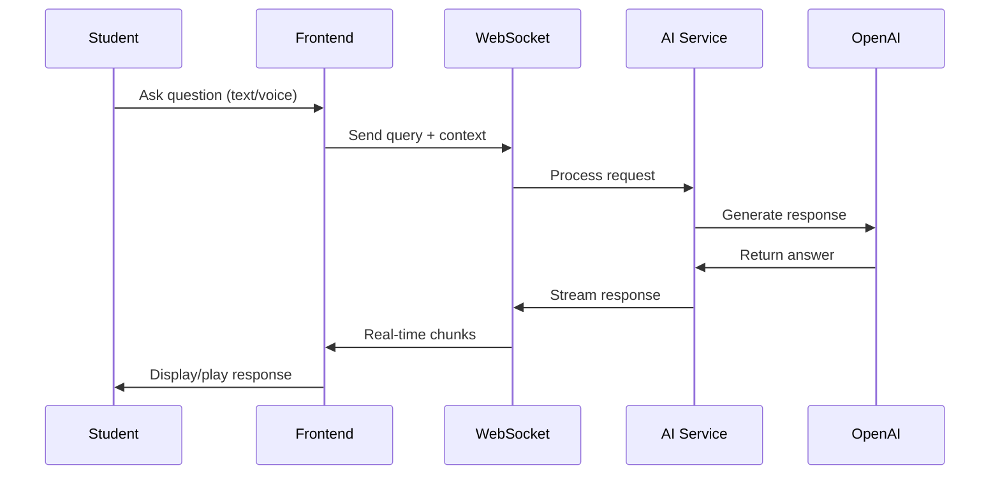

#### **3.5.2 Practice Generation**

**FR-AI-003: Exercise Generation**
- **Priority:** P1 (High)
- **Description:** AI tutor SHALL generate custom practice exercises
- **Capabilities:**
  - Grammar exercises
  - Vocabulary drills
  - Conversation simulations
  - Writing feedback
  - Speaking assessment

**Traceability:**
- Implementation: `src/pages/practice/` directory
- Services: `src/services/*Service.ts` files

### **3.6 Communication**

#### **3.6.1 Messaging**

**FR-COM-001: Direct Messaging**
- **Priority:** P1 (High)
- **Description:** Users SHALL send direct messages to other users
- **Features:**
  - One-on-one conversations
  - Group conversations
  - Message history
  - Unread indicators
  - Typing indicators
  - Online status
  - Message notifications

**Traceability:**
- Implementation: `src/pages/MessagesPage.tsx`
- Database: `conversations`, `conversation_participants`, `messages` tables

#### **3.6.2 Discussions**

**FR-COM-002: Discussion Forums**
- **Priority:** P1 (High)
- **Description:** Courses SHALL have discussion forums
- **Features:**
  - Topic creation
  - Threaded replies
  - Like/upvote
  - Moderation tools
  - Search functionality

**Traceability:**
- Implementation: `src/pages/DiscussionsPage.tsx`
- Database: `discussions`, `discussion_messages` tables

#### **3.6.3 Zoom Integration**

**FR-COM-003: Video Meetings**
- **Priority:** P2 (Medium)
- **Description:** Teachers SHALL schedule Zoom meetings
- **Features:**
  - Meeting creation
  - Calendar integration
  - Automatic invitations
  - Join links
  - Recording management

**Traceability:**
- Implementation: `src/services/meetingService.ts`
- Database: `meetings` table

### **3.7 Analytics & Reporting**

#### **3.7.1 Student Analytics**

**FR-AR-001: Progress Dashboard**
- **Priority:** P1 (High)
- **Description:** Students SHALL view personal progress metrics
- **Metrics:**
  - Course completion percentage
  - Quiz scores
  - Assignment grades
  - Study time
  - Skill breakdown
  - Learning streak

**FR-AR-002: Teacher Analytics**
- **Priority:** P1 (High)
- **Description:** Teachers SHALL view class analytics
- **Metrics:**
  - Student enrollment trends
  - Completion rates
  - Average grades
  - Engagement heatmaps
  - At-risk student identification
  - Content efficacy

**Traceability:**
- Implementation: `src/components/dashboard/TeacherDashboard.tsx`, `src/services/teacherReportsService.ts`

#### **3.7.2 Admin Reporting**

**FR-AR-003: System Reports**
- **Priority:** P1 (High)
- **Description:** Admins SHALL access system-wide reports
- **Reports:**
  - User activity
  - Course catalog
  - Revenue (if payments enabled)
  - Resource utilization
  - Audit logs

**FR-AR-004: IRIS AI Assistant**
- **Priority:** P2 (Medium)
- **Description:** Admins SHALL query data via conversational AI
- **Features:**
  - Natural language queries
  - SQL generation
  - Data visualization
  - Export capability

**Traceability:**
- Implementation: `src/components/admin/IRISv2.tsx`, `supabase/functions/iris-chat-simple/`

### **3.8 Offline Learning**

#### **3.8.1 Course Download**

**FR-OL-001: Download Capability**
- **Priority:** P1 (High)
- **Description:** Students SHALL download courses for offline access
- **Requirements:**
  - Selective download (enrolled courses only)
  - Video compression
  - Asset bundling
  - Progress tracking
  - Storage management
  - Download resume capability

**FR-OL-002: Offline Playback**
- **Priority:** P1 (High)
- **Description:** Students SHALL access downloaded content offline
- **Requirements:**
  - Local video playback
  - Text content rendering
  - Progress tracking (local storage)
  - Quiz/assignment unavailable (online required)
  - Automatic sync when online

**Traceability:**
- Implementation: `src/services/courseDownloadService.ts`, `src/services/offlineDatabase.ts`
- Storage: IndexedDB for local course data

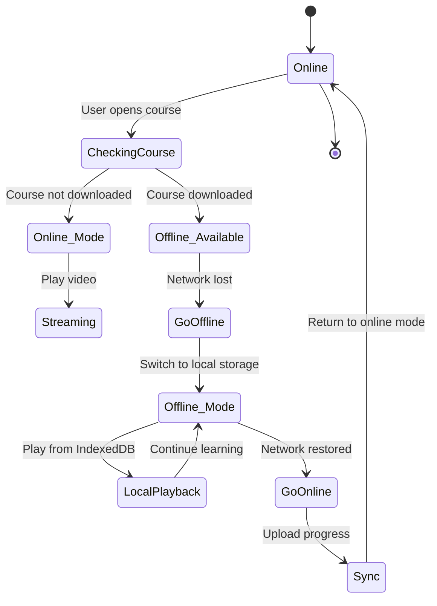

---

## **4. System Architecture**

### **4.1 High-Level Architecture**

#### **4.1.1 C4 Model - Level 1 (System Context)**

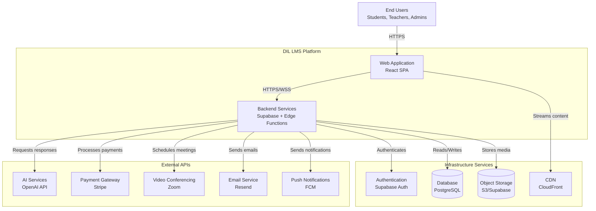

**Figure 4.1: High-Level System Architecture**

#### **4.1.2 C4 Model - Level 2 (Container Diagram)**

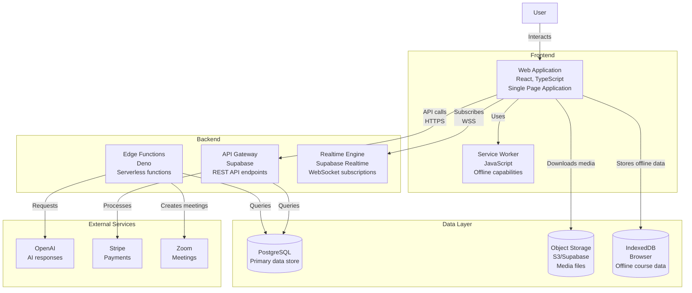

**Figure 4.2: Container Architecture Diagram**

### **4.2 Component Architecture**

#### **4.2.1 Frontend Architecture**

**Architecture Pattern:** Component-Based Architecture with Feature Modules

```
src/
├── components/          # Reusable UI components
│   ├── ui/             # Base UI components (shadcn/ui)
│   ├── admin/          # Admin-specific components
│   ├── dashboard/      # Dashboard widgets
│   ├── course/         # Course-related components
│   └── ...
├── pages/              # Route-level components
├── contexts/           # React Context providers
├── hooks/              # Custom React hooks
├── services/           # API service layers
├── utils/              # Utility functions
└── integrations/       # Third-party integrations
```

**Key Architectural Decisions:**

| **Decision** | **Rationale** | **Trade-off** |
|--------------|---------------|---------------|
| React SPA | Rich interactivity, offline support | Initial load time |
| TypeScript | Type safety, better IDE support | Learning curve |
| shadcn/ui | Customizable components | Manual updates |
| React Query | Server state management, caching | Bundle size |
| IndexedDB | Offline course storage | Browser compatibility |

#### **4.2.2 Backend Architecture**

**Architecture Pattern:** Serverless Microservices with Edge Functions

```
supabase/
├── functions/                  # Edge Functions (Deno)
│   ├── create-checkout-session/
│   ├── stripe-webhook/
│   ├── send-notification/
│   ├── send-email/
│   ├── iris-chat-simple/
│   └── ...
└── migrations/                 # Database migrations
```

**Edge Functions Deployment:**
- Runtime: Deno
- Trigger: HTTP endpoints
- Authentication: JWT validation
- Timeout: 150 seconds
- Memory: 512 MB

### **4.3 Data Flow**

#### **4.3.1 Course Enrollment Flow**

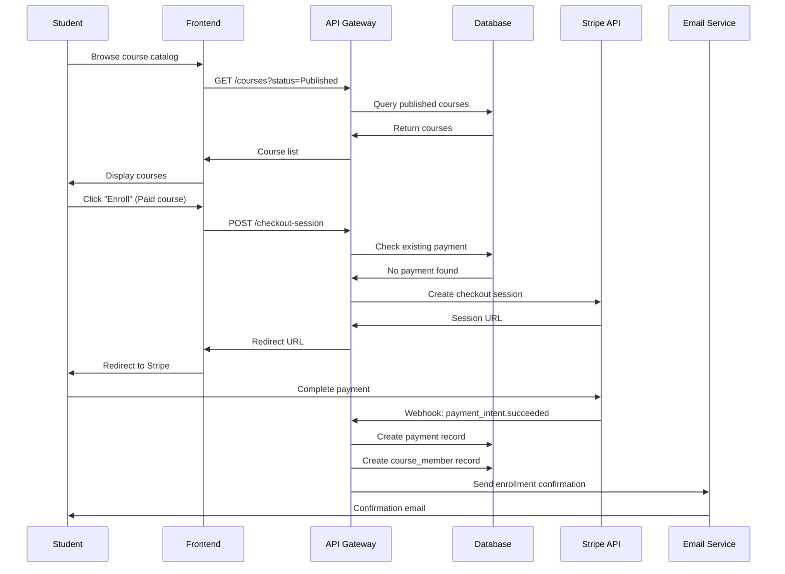

#### **4.3.2 AI Tutor Interaction Flow**

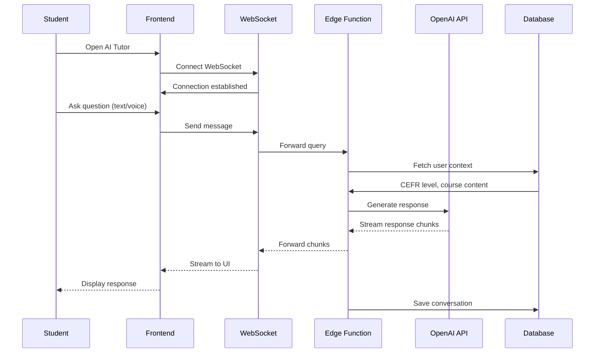

### **4.4 Technology Stack**

#### **4.4.1 Frontend Stack**

| **Layer** | **Technology** | **Version** | **Purpose** |
|-----------|---------------|-------------|-------------|
| **Framework** | React | 18.x | UI library |
| **Language** | TypeScript | 5.x | Type safety |
| **Build Tool** | Vite | 5.x | Fast dev server, bundling |
| **Routing** | React Router | 6.x | Client-side routing |
| **State Management** | React Query | 5.x | Server state |
| **UI Components** | shadcn/ui | Latest | Component library |
| **Styling** | Tailwind CSS | 3.x | Utility-first CSS |
| **Icons** | Lucide React | Latest | Icon library |
| **Forms** | React Hook Form | 7.x | Form management |
| **Validation** | Zod | 3.x | Schema validation |
| **HTTP Client** | Fetch API | Native | API requests |
| **WebSocket** | Native WebSocket | Native | Real-time communication |
| **Offline Storage** | IndexedDB | Native | Offline course data |

#### **4.4.2 Backend Stack**

| **Layer** | **Technology** | **Version** | **Purpose** |
|-----------|---------------|-------------|-------------|
| **Backend Platform** | Supabase | Latest | BaaS platform |
| **Database** | PostgreSQL | 15.x | Primary database |
| **Auth** | Supabase Auth | Latest | Authentication |
| **Storage** | Supabase Storage | Latest | File storage |
| **Realtime** | Supabase Realtime | Latest | WebSocket server |
| **Edge Functions** | Deno | 1.x | Serverless functions |
| **API Gateway** | PostgREST | 11.x | REST API |

#### **4.4.3 External Services**

| **Service** | **Provider** | **Purpose** |
|-------------|--------------|-------------|
| **AI/LLM** | OpenAI | GPT-4 for AI tutor |
| **Payments** | Stripe | Payment processing |
| **Video Meetings** | Zoom | Live classes |
| **Email** | Resend | Transactional emails |
| **Push Notifications** | Firebase Cloud Messaging | Browser notifications |
| **CDN** | AWS CloudFront | Content delivery |
| **Storage** | AWS S3 | Media storage |

#### **4.4.4 Development Tools**

| **Tool** | **Purpose** |
|----------|-------------|
| **Version Control** | Git, GitHub |
| **CI/CD** | GitHub Actions |
| **Package Manager** | npm |
| **Code Editor** | VS Code |
| **Linting** | ESLint |
| **Formatting** | Prettier |
| **Type Checking** | TypeScript Compiler |

---

## **5. Database Design**

### **5.1 Entity Relationship Diagram**

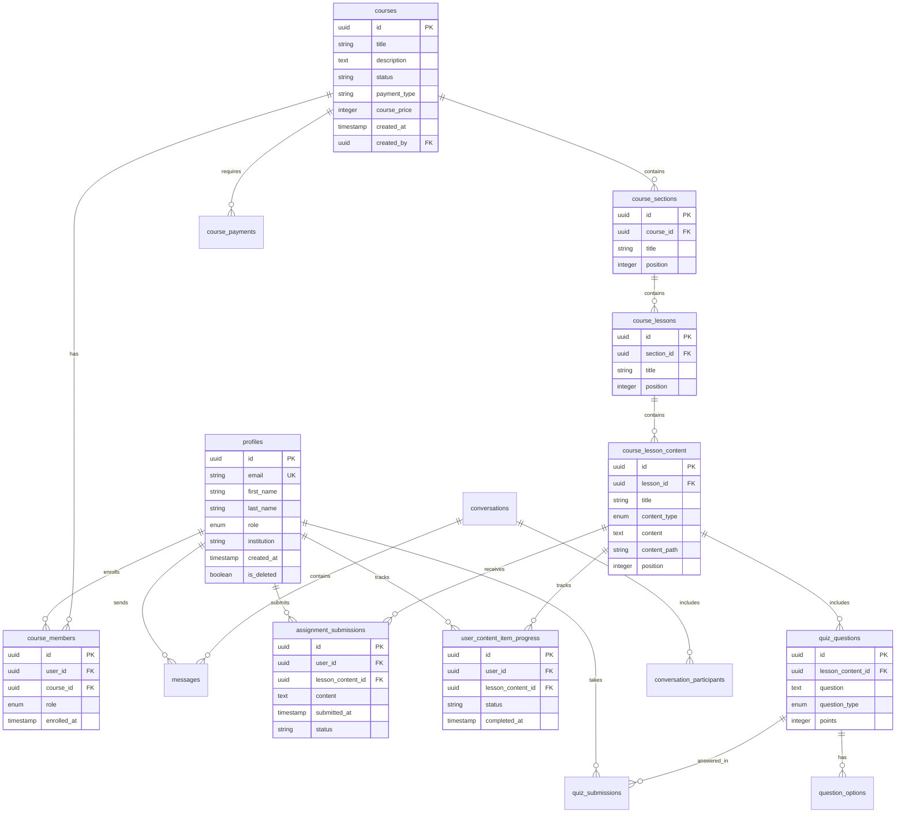

### **5.2 Key Entities**

#### **5.2.1 Core Entities**

**profiles**
- Primary entity for user accounts
- Links to Supabase Auth
- Supports soft delete (is_deleted flag)
- Role-based access control

**courses**
- Primary entity for learning content
- Hierarchical structure: Course → Section → Lesson → Content
- Status workflow: Draft → Under Review → Published
- Payment support: Free or Paid

**course_lesson_content**
- Polymorphic content types: video, text, quiz, assignment, attachment
- Progress tracking per user
- Supports offline availability flag

#### **5.2.2 Relationship Tables**

**course_members**
- Many-to-many: users ↔ courses
- Role within course: student, teacher, admin
- Enrollment timestamp tracking

**conversation_participants**
- Many-to-many: users ↔ conversations
- Support for group conversations
- Block/mute capabilities

### **5.3 Data Model**

#### **5.3.1 User Role Enumeration**

```sql
CREATE TYPE app_role AS ENUM (
  'student',
  'teacher',
  'admin',
  'content_creator',
  'super_user',
  'view_only'
);
```

#### **5.3.2 Content Type Enumeration**

```sql
CREATE TYPE content_type AS ENUM (
  'video',
  'text',
  'quiz',
  'assignment',
  'attachment',
  'lesson_plan'
);
```

#### **5.3.3 Key Indexes**

| **Table** | **Index** | **Columns** | **Purpose** |
|-----------|-----------|-------------|-------------|
| profiles | idx_profiles_email | email | Fast user lookup |
| profiles | idx_profiles_role | role | Role-based queries |
| courses | idx_courses_status | status | Published courses |
| course_members | idx_course_members_user | user_id | User enrollments |
| user_content_item_progress | idx_progress_user_course | user_id, course_id | Progress queries |
| messages | idx_messages_conversation | conversation_id | Message retrieval |

#### **5.3.4 Row-Level Security (RLS)**

**Example: courses table**

```sql
-- Students can view published courses
CREATE POLICY "Students can view published courses"
  ON courses FOR SELECT
  USING (
    status = 'Published'
    AND auth.uid() IN (
      SELECT user_id FROM profiles WHERE role = 'student'
    )
  );

-- Teachers can view their own courses
CREATE POLICY "Teachers can view own courses"
  ON courses FOR SELECT
  USING (
    created_by = auth.uid()
    AND auth.uid() IN (
      SELECT user_id FROM profiles WHERE role = 'teacher'
    )
  );

-- Admins can view all courses
CREATE POLICY "Admins can view all courses"
  ON courses FOR SELECT
  USING (
    auth.uid() IN (
      SELECT user_id FROM profiles WHERE role IN ('admin', 'super_user')
    )
  );
```

---

## **6. API Specifications**

### **6.1 Authentication APIs**

#### **6.1.1 Sign Up**

**Endpoint:** `POST /auth/v1/signup`  
**Provider:** Supabase Auth  
**Authentication:** None (public)

**Request:**
```json
{
  "email": "student@example.com",
  "password": "SecureP@ssw0rd123",
  "options": {
    "data": {
      "role": "student",
      "first_name": "John",
      "last_name": "Doe",
      "grade": "10"
    },
    "emailRedirectTo": "https://learn.dil.org/dashboard"
  }
}
```

**Response:**
```json
{
  "user": {
    "id": "uuid",
    "email": "student@example.com",
    "email_confirmed_at": null,
    "created_at": "2025-11-03T10:00:00Z"
  },
  "session": null
}
```

#### **6.1.2 Sign In**

**Endpoint:** `POST /auth/v1/token?grant_type=password`  
**Provider:** Supabase Auth

**Request:**
```json
{
  "email": "student@example.com",
  "password": "SecureP@ssw0rd123"
}
```

**Response:**
```json
{
  "access_token": "jwt_token",
  "token_type": "bearer",
  "expires_in": 3600,
  "refresh_token": "refresh_token",
  "user": {
    "id": "uuid",
    "email": "student@example.com"
  }
}
```

### **6.2 Course APIs**

#### **6.2.1 List Courses**

**Endpoint:** `GET /rest/v1/courses`  
**Provider:** PostgREST (Supabase)  
**Authentication:** Bearer token

**Query Parameters:**
- `status=eq.Published` - Filter by status
- `select=*,sections:course_sections(*)` - Include relations
- `order=created_at.desc` - Sorting

**Response:**
```json
[
  {
    "id": "uuid",
    "title": "English for Beginners",
    "description": "CEFR A1 level course",
    "status": "Published",
    "payment_type": "free",
    "course_price": 0,
    "created_at": "2025-10-01T00:00:00Z",
    "sections": [...]
  }
]
```

#### **6.2.2 Get Course Content**

**Endpoint:** `GET /rest/v1/courses?id=eq.{courseId}`  
**Select:** Complex nested query

```
*,
sections:course_sections(
  *,
  lessons:course_lessons(
    *,
    contentItems:course_lesson_content(
      *,
      quiz:quiz_questions(
        *,
        options:question_options(*)
      )
    )
  )
)
```

### **6.3 AI Tutor APIs**

#### **6.3.1 WebSocket Connection**

**Endpoint:** `wss://ai-tutor-websocket.dil.org`  
**Protocol:** WebSocket  
**Authentication:** JWT in connection params

**Message Format (Client → Server):**
```json
{
  "type": "audio" | "text",
  "content": "base64_audio" | "text_query",
  "context": {
    "courseId": "uuid",
    "lessonId": "uuid",
    "cefrLevel": "A1"
  }
}
```

**Message Format (Server → Client):**
```json
{
  "type": "response",
  "content": {
    "text": "AI response text",
    "audioBase64": "base64_audio",
    "done": false
  }
}
```

### **6.4 Edge Functions**

#### **6.4.1 Create Checkout Session**

**Endpoint:** `POST /functions/v1/create-checkout-session`  
**Runtime:** Deno  
**Authentication:** Bearer token

**Request:**
```json
{
  "courseId": "uuid"
}
```

**Response:**
```json
{
  "sessionId": "cs_stripe_session_id",
  "url": "https://checkout.stripe.com/..."
}
```

#### **6.4.2 Send Notification**

**Endpoint:** `POST /functions/v1/send-notification`  
**Runtime:** Deno  
**Authentication:** Service role key

**Request:**
```json
{
  "type": "assignment_due",
  "title": "Assignment Due Soon",
  "body": "Your assignment is due in 24 hours",
  "data": {
    "assignmentId": "uuid",
    "courseId": "uuid"
  },
  "targetUsers": ["uuid1", "uuid2"]
}
```

**Response:**
```json
{
  "success": true,
  "notificationsSent": 2
}
```

---

## **7. User Interface Design**

### **7.1 Design Principles**

#### **7.1.1 Design System**

**Brand Colors:**
- Primary: `#1582B4` (Teal Blue)
- Secondary: Derived from primary
- Accent: Complementary colors

**Typography:**
- Font Family: System fonts (Inter, SF Pro, Roboto)
- Heading Scale: 3xl, 2xl, xl, lg, base
- Body Text: base (16px)

**Spacing:**
- Base unit: 4px
- Scale: 1, 2, 3, 4, 6, 8, 12, 16, 24, 32, 48, 64

**Components:**
- UI Library: shadcn/ui (Radix UI primitives)
- Customizable, accessible components
- Dark mode support

#### **7.1.2 Responsive Design**

**Breakpoints:**
- Mobile: < 640px
- Tablet: 640px - 1024px
- Desktop: > 1024px

**Approach:**
- Mobile-first design
- Responsive typography
- Flexible layouts (Flexbox, CSS Grid)
- Touch-friendly targets (min 44x44px)

### **7.2 User Flows**

#### **7.2.1 Student Course Enrollment**

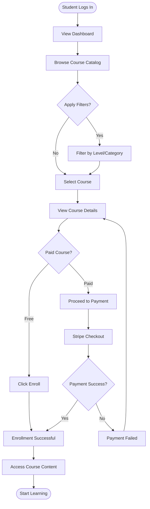

#### **7.2.2 Teacher Course Creation**

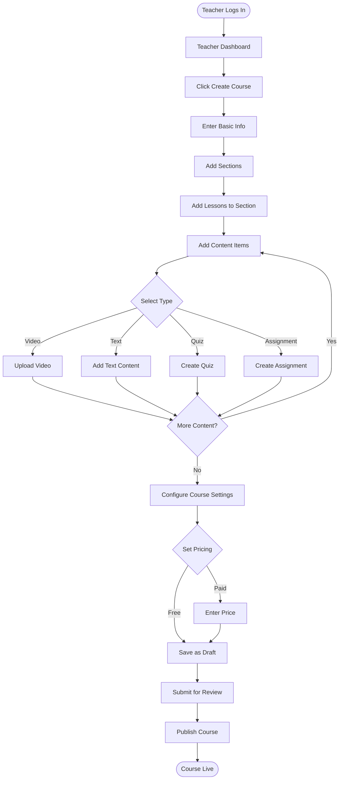

### **7.3 Screen Layouts**

#### **7.3.1 Dashboard Layout**

**Structure:**
```
┌─────────────────────────────────────────────┐
│ Header (Logo, Navigation, Profile)         │
├──────────┬──────────────────────────────────┤
│          │                                  │
│ Sidebar  │  Main Content Area               │
│          │                                  │
│ - Home   │  ┌─────────────────────────┐   │
│ - Course │  │ Widget 1                │   │
│ - AI     │  └─────────────────────────┘   │
│ - Msgs   │                                  │
│          │  ┌──────────┐  ┌──────────┐    │
│          │  │ Widget 2 │  │ Widget 3 │    │
│          │  └──────────┘  └──────────┘    │
│          │                                  │
└──────────┴──────────────────────────────────┘
```

**Responsive Behavior:**
- Desktop: Persistent sidebar
- Tablet: Collapsible sidebar
- Mobile: Bottom navigation + hamburger menu

#### **7.3.2 Course Player Layout**

**Structure:**
```
┌─────────────────────────────────────────────┐
│ Header (Course Title, Progress)            │
├──────────┬──────────────────────────────────┤
│          │                                  │
│ Content  │  Video Player / Content          │
│ Nav      │                                  │
│          │  ┌──────────────────────────┐   │
│ Section1 │  │                          │   │
│  Lesson1 │  │   Main Content Display   │   │
│  Lesson2 │  │                          │   │
│ Section2 │  └──────────────────────────┘   │
│  Lesson3 │                                  │
│          │  [Previous]    [Next Lesson]     │
│          │                                  │
│          │  ┌─ AI Tutor (Floating) ─┐      │
│          │  │ Ask me anything...     │      │
└──────────┴──┴────────────────────────┴──────┘
```

---

## **8. Security & Compliance**

### **8.1 Authentication & Authorization**

#### **8.1.1 Authentication Mechanisms**

**Primary Authentication:**
- Email/Password with bcrypt hashing
- JWT tokens (access + refresh)
- Token expiry: 1 hour (access), 7 days (refresh)

**Multi-Factor Authentication:**
- TOTP-based (RFC 6238)
- 6-digit codes, 30-second validity
- Backup codes (10 codes, single-use)
- Optional enrollment, admin-enforceable

**Session Management:**
- Automatic session timeout: 2 hours inactivity
- Concurrent session support
- Session invalidation on password change

#### **8.1.2 Authorization Model**

**Role-Based Access Control (RBAC):**

| **Resource** | **Student** | **Teacher** | **Content Creator** | **Admin** | **Super User** | **View Only** |
|--------------|-------------|-------------|---------------------|-----------|----------------|---------------|
| View Published Courses | ✅ | ✅ | ✅ | ✅ | ✅ | ✅ |
| Enroll in Courses | ✅ | ❌ | ❌ | ❌ | ❌ | ❌ |
| Create Courses | ❌ | ✅ | ✅ | ✅ | ✅ | ❌ |
| Delete Courses | ❌ | ✅ | ❌ | ✅ | ✅ | ❌ |
| Manage Users | ❌ | ❌ | ❌ | ✅ | ✅ | ❌ |
| Access AI Tutor | ✅ | ✅ | ❌ | ✅ | ✅ | ❌ |
| View Analytics | Own | Class | ❌ | All | All | Limited |
| System Config | ❌ | ❌ | ❌ | ✅ | ✅ | ❌ |

**Row-Level Security:**
- Implemented via PostgreSQL RLS policies
- Enforced at database level
- Cannot be bypassed from application

### **8.2 Data Security**

#### **8.2.1 Encryption**

**Data at Rest:**
- Database: AES-256 encryption (AWS RDS)
- Object Storage: AES-256 encryption (S3)
- Backup: Encrypted snapshots

**Data in Transit:**
- TLS 1.3 for all HTTPS connections
- WSS (WebSocket Secure) for real-time
- Certificate: Let's Encrypt / AWS ACM

**Sensitive Data:**
- Passwords: bcrypt (cost factor 12)
- API Keys: Encrypted in database
- PII: Encrypted columns where applicable

#### **8.2.2 Data Privacy**

**Personal Identifiable Information (PII):**
- Name, Email, Date of Birth
- Stored with consent
- Anonymized in analytics
- Right to deletion (GDPR/FERPA)

**Data Minimization:**
- Collect only necessary data
- Optional fields clearly marked
- No third-party data sharing (except service providers)

#### **8.2.3 Access Logging**

**Audit Trail:**
- User actions logged
- Failed login attempts
- Admin operations
- Data export/deletion requests
- Retention: 7 years

**Implementation:**
```sql
CREATE TABLE access_logs (
  id UUID PRIMARY KEY,
  user_id UUID REFERENCES profiles(id),
  action TEXT,
  resource TEXT,
  ip_address INET,
  user_agent TEXT,
  timestamp TIMESTAMPTZ DEFAULT NOW()
);
```

### **8.3 Compliance**

#### **8.3.1 GDPR Compliance**

**Requirements:**
- [ ] Consent management
- [ ] Right to access (data export)
- [ ] Right to erasure (account deletion)
- [ ] Right to rectification (profile updates)
- [ ] Data portability (JSON export)
- [ ] Privacy by design
- [ ] Data breach notification (72 hours)

**Implementation:**
- `GET /api/user/export` - Export user data
- `DELETE /api/user/delete` - Delete account (30-day grace)
- Privacy policy acceptance required

#### **8.3.2 FERPA Compliance (Educational Records)**

**Requirements:**
- [ ] Written consent for data disclosure
- [ ] Student access to educational records
- [ ] Right to request amendments
- [ ] Limits on disclosure

**Educational Records in System:**
- Course enrollments
- Grades and assignments
- Progress data
- AI tutor interactions

#### **8.3.3 Security Best Practices**

**OWASP Top 10 Mitigation:**

| **Vulnerability** | **Mitigation** |
|-------------------|----------------|
| Injection | Parameterized queries, ORM |
| Broken Authentication | MFA, session timeout, password policy |
| Sensitive Data Exposure | Encryption, HTTPS, secure cookies |
| XML External Entities | N/A (no XML processing) |
| Broken Access Control | RLS, RBAC, principle of least privilege |
| Security Misconfiguration | Secure defaults, regular updates |
| XSS | React escaping, CSP headers |
| Insecure Deserialization | Input validation, type checking |
| Using Components with Known Vulnerabilities | Dependency scanning, npm audit |
| Insufficient Logging & Monitoring | Audit logs, error tracking |

**Content Security Policy:**
```
Content-Security-Policy: 
  default-src 'self'; 
  script-src 'self' 'unsafe-inline'; 
  style-src 'self' 'unsafe-inline'; 
  img-src 'self' data: https:; 
  connect-src 'self' wss: https:;
```

---

## **9. Integration Points**

### **9.1 Third-Party Integrations**

#### **9.1.1 Stripe Payment Integration**

**Purpose:** Process payments for paid courses

**Integration Type:** REST API + Webhooks

**Key Endpoints:**
- `POST /v1/checkout/sessions` - Create checkout session
- `POST /v1/webhooks` - Receive payment events

**Webhook Events:**
- `payment_intent.succeeded` → Enroll user in course
- `payment_intent.payment_failed` → Notify user
- `charge.refunded` → Revoke course access

**Configuration:**
```typescript
// Stored in integrations table
{
  "name": "stripe",
  "status": "enabled",
  "settings": {
    "publishable_key": "pk_live_...",
    "secret_key": "sk_live_...",
    "webhook_secret": "whsec_..."
  }
}
```

**Security:**
- Webhook signature verification
- Idempotency keys
- Test mode support

#### **9.1.2 Zoom Meeting Integration**

**Purpose:** Schedule and manage live video classes

**Integration Type:** Server-to-Server OAuth + REST API

**Key Endpoints:**
- `POST /v2/users/{userId}/meetings` - Create meeting
- `PATCH /v2/meetings/{meetingId}` - Update meeting
- `DELETE /v2/meetings/{meetingId}` - Cancel meeting

**OAuth Configuration:**
```typescript
{
  "name": "zoom",
  "status": "enabled",
  "settings": {
    "account_id": "...",
    "client_id": "...",
    "client_secret": "...",
    "auth_type": "oauth"
  }
}
```

**Features:**
- Meeting creation with course context
- Calendar invitations
- Join URL distribution
- Recording management

#### **9.1.3 OpenAI API Integration**

**Purpose:** Power AI Tutor with GPT-4

**Integration Type:** REST API (streaming)

**Model:** GPT-4 Turbo

**Context Window:** 128k tokens

**Request Format:**
```json
{
  "model": "gpt-4-turbo",
  "messages": [
    {
      "role": "system",
      "content": "You are an AI tutor for CEFR A1 English learners..."
    },
    {
      "role": "user",
      "content": "Explain the difference between 'in' and 'on'"
    }
  ],
  "temperature": 0.7,
  "stream": true
}
```

**Cost Optimization:**
- Context caching
- Response length limits
- Rate limiting per user

### **9.2 External APIs**

#### **9.2.1 Email Service (Resend)**

**Purpose:** Send transactional emails

**Endpoint:** `POST https://api.resend.com/emails`

**Email Types:**
- Email verification
- Password reset
- Course enrollment confirmation
- Assignment graded notification
- Weekly progress summary

**Template Structure:**
```html
<!DOCTYPE html>
<html>
<head>
  <style>/* Inline CSS */</style>
</head>
<body>
  <div class="container">
    <h1>{{ title }}</h1>
    <p>{{ body }}</p>
    <a href="{{ action_url }}" class="button">{{ action_text }}</a>
  </div>
</body>
</html>
```

#### **9.2.2 Firebase Cloud Messaging (FCM)**

**Purpose:** Send push notifications to browsers

**Endpoint:** `POST https://fcm.googleapis.com/v1/projects/{projectId}/messages:send`

**Message Format:**
```json
{
  "message": {
    "token": "fcm_device_token",
    "notification": {
      "title": "New Assignment Posted",
      "body": "Your teacher posted a new assignment"
    },
    "data": {
      "type": "assignment",
      "assignmentId": "uuid",
      "courseId": "uuid"
    }
  }
}
```

**Notification Types:**
- New message received
- Assignment due reminder
- Grade posted
- Discussion reply
- System announcements

---

## **10. Deployment Architecture**

### **10.1 Infrastructure**

#### **10.1.1 Infrastructure Diagram**

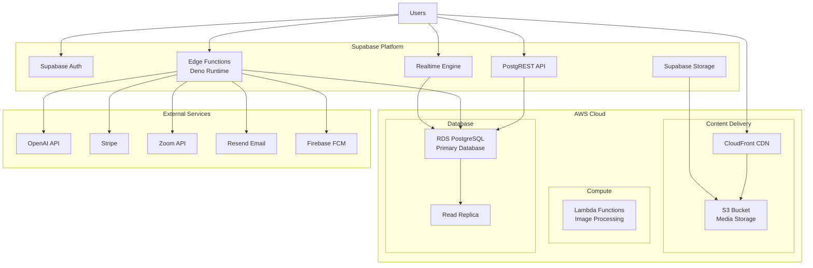

#### **10.1.2 Infrastructure Components**

| **Component** | **Service** | **Purpose** | **Region** |
|---------------|-------------|-------------|------------|
| **Frontend Hosting** | Vercel / AWS Amplify | Static site hosting | Global (CDN) |
| **Backend** | Supabase | Database, Auth, API | US East |
| **Media Storage** | AWS S3 | Video, image storage | US East |
| **CDN** | AWS CloudFront | Content delivery | Global |
| **Edge Functions** | Supabase Edge | Serverless compute | Global |
| **Database** | RDS PostgreSQL | Primary data store | US East |
| **Cache** | Redis (Optional) | Session cache | US East |

### **10.2 CI/CD Pipeline**

#### **10.2.1 Pipeline Diagram**

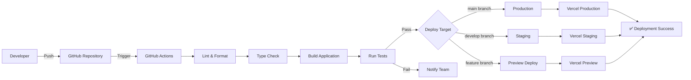

#### **10.2.2 GitHub Actions Workflow**

**.github/workflows/deploy.yml**
```yaml
name: Deploy

on:
  push:
    branches: [main, develop]
  pull_request:
    branches: [main]

jobs:
  lint-and-build:
    runs-on: ubuntu-latest
    steps:
      - uses: actions/checkout@v4
      - uses: actions/setup-node@v4
        with:
          node-version: '20'
      
      - name: Install dependencies
        run: npm ci
      
      - name: Lint
        run: npm run lint
      
      - name: Type check
        run: npm run type-check
      
      - name: Build
        run: npm run build
      
      - name: Run tests
        run: npm run test
  
  deploy-production:
    needs: lint-and-build
    if: github.ref == 'refs/heads/main'
    runs-on: ubuntu-latest
    steps:
      - uses: actions/checkout@v4
      - uses: vercel/action@v1
        with:
          vercel-token: ${{ secrets.VERCEL_TOKEN }}
          vercel-org-id: ${{ secrets.VERCEL_ORG_ID }}
          vercel-project-id: ${{ secrets.VERCEL_PROJECT_ID }}
          vercel-args: '--prod'
```

### **10.3 Environments**

#### **10.3.1 Environment Configuration**

| **Environment** | **Purpose** | **URL** | **Database** |
|-----------------|-------------|---------|--------------|
| **Development** | Local development | `localhost:8080` | Local Supabase |
| **Staging** | Pre-production testing | `staging.learn.dil.org` | Staging DB |
| **Production** | Live system | `learn.dil.org` | Production DB |

#### **10.3.2 Environment Variables**

**.env.example**
```bash
# Supabase
VITE_SUPABASE_URL=https://xxx.supabase.co
VITE_SUPABASE_ANON_KEY=eyJhbGc...

# OpenAI
OPENAI_API_KEY=sk-...

# Stripe
VITE_STRIPE_PUBLISHABLE_KEY=pk_test_...
STRIPE_SECRET_KEY=sk_test_...
STRIPE_WEBHOOK_SECRET=whsec_...

# AWS
AWS_ACCESS_KEY_ID=AKIA...
AWS_SECRET_ACCESS_KEY=...
AWS_REGION=us-east-1
AWS_S3_BUCKET=dil-lms-media

# Zoom
ZOOM_ACCOUNT_ID=...
ZOOM_CLIENT_ID=...
ZOOM_CLIENT_SECRET=...

# Email
RESEND_API_KEY=re_...

# Firebase
FIREBASE_PROJECT_ID=dil-lms
FIREBASE_PRIVATE_KEY=...
FIREBASE_CLIENT_EMAIL=...
```

---

## **11. Non-Functional Requirements**

### **11.1 Performance**

#### **11.1.1 Response Time Requirements**

| **Operation** | **Target** | **Maximum** | **Measurement** |
|---------------|------------|-------------|-----------------|
| Page Load (Initial) | < 2s | 3s | First Contentful Paint |
| Page Load (Subsequent) | < 1s | 1.5s | Time to Interactive |
| API Request (GET) | < 200ms | 500ms | P95 latency |
| API Request (POST) | < 500ms | 1s | P95 latency |
| Video Start | < 2s | 3s | Time to first frame |
| AI Tutor Response | < 3s | 5s | First token |
| Search Query | < 300ms | 1s | Results displayed |

#### **11.1.2 Throughput Requirements**

| **Metric** | **Target** | **Peak** |
|------------|------------|----------|
| Concurrent Users | 10,000 | 50,000 |
| Requests per Second | 1,000 | 5,000 |
| Video Streams | 5,000 | 10,000 |
| Database Connections | 100 | 500 |

#### **11.1.3 Resource Utilization**

| **Resource** | **Target** | **Limit** |
|--------------|------------|-----------|
| Frontend Bundle Size | < 500 KB | 1 MB |
| Memory per User Session | < 100 MB | 200 MB |
| IndexedDB Storage | < 2 GB | 5 GB |
| Video Bitrate | Adaptive (500-5000 kbps) | 5 Mbps |

### **11.2 Scalability**

#### **11.2.1 Horizontal Scaling**

**Application Tier:**
- Stateless frontend (CDN distribution)
- Serverless edge functions (auto-scaling)
- Load balancing via cloud provider

**Database Tier:**
- Read replicas for read-heavy operations
- Connection pooling (PgBouncer)
- Query optimization and indexing

**Storage Tier:**
- Object storage (virtually unlimited)
- CDN caching (CloudFront)
- Multi-region distribution

#### **11.2.2 Vertical Scaling**

**Database:**
- Current: db.t3.medium (2 vCPU, 4 GB RAM)
- Upgrade Path: db.r6g.xlarge (4 vCPU, 32 GB RAM)

**Edge Functions:**
- Current: 512 MB memory, 150s timeout
- No vertical scaling needed (horizontal auto-scale)

### **11.3 Availability**

#### **11.3.1 Uptime Requirements**

**SLA:** 99.9% uptime (43.8 minutes downtime/month)

**High Availability Design:**
- Multi-AZ database deployment
- CDN with origin failover
- Edge function redundancy
- Automatic health checks
- Graceful degradation

#### **11.3.2 Disaster Recovery**

**Backup Strategy:**
- Database: Automated daily backups, 30-day retention
- Point-in-time recovery: 5-minute granularity
- Media files: S3 versioning enabled
- Configuration: Infrastructure as Code (Git)

**Recovery Objectives:**
- **RTO (Recovery Time Objective):** < 1 hour
- **RPO (Recovery Point Objective):** < 5 minutes

**Disaster Recovery Plan:**
1. Detect outage (automated monitoring)
2. Notify on-call engineer
3. Assess impact and root cause
4. Execute recovery procedure:
   - Restore database from latest backup
   - Verify data integrity
   - Switch DNS to backup region (if needed)
   - Resume operations
5. Post-mortem analysis

### **11.4 Maintainability**

#### **11.4.1 Code Quality**

**Standards:**
- ESLint for code linting
- Prettier for formatting
- TypeScript for type safety
- Code review required (2 approvals)
- Automated testing (unit + integration)

**Metrics:**
- Code coverage: > 70%
- Cyclomatic complexity: < 10 per function
- Technical debt ratio: < 5%

#### **11.4.2 Documentation**

**Required Documentation:**
- [x] Functional Design Document (this document)
- [x] User Guide
- [ ] API Documentation (auto-generated)
- [ ] Deployment Runbook
- [ ] Incident Response Playbook
- [x] Code Comments (inline)

#### **11.4.3 Monitoring & Observability**

**Monitoring Stack:**
- Frontend: Vercel Analytics
- Backend: Supabase Monitoring
- Errors: Sentry (error tracking)
- Logs: CloudWatch Logs
- Metrics: CloudWatch Metrics
- APM: OpenTelemetry (future)

**Key Metrics:**
- Error rate (< 0.1%)
- Response time (P50, P95, P99)
- Throughput (requests/sec)
- Database performance (query time)
- User sessions (active users)

**Alerting:**
- Error rate spike (> 1%)
- Response time degradation (> 2x baseline)
- Database connection exhaustion
- Disk space > 80%
- SSL certificate expiry (< 30 days)

---

## **12. Appendices**

### **12.1 Glossary**

| **Term** | **Definition** |
|----------|----------------|
| **AI Tutor** | Conversational AI assistant powered by GPT-4 for learning support |
| **CEFR** | Common European Framework of Reference for Languages (A1-C2) |
| **Edge Function** | Serverless function running on Deno runtime (Supabase) |
| **HLS** | HTTP Live Streaming protocol for adaptive video streaming |
| **IndexedDB** | Browser database for offline course storage |
| **JWT** | JSON Web Token for authentication |
| **LMS** | Learning Management System |
| **MFA** | Multi-Factor Authentication (TOTP-based) |
| **PostgREST** | REST API automatically generated from PostgreSQL schema |
| **RLS** | Row-Level Security in PostgreSQL |
| **SPA** | Single Page Application (React) |
| **TOTP** | Time-based One-Time Password (RFC 6238) |
| **WebSocket** | Full-duplex communication protocol for real-time features |

### **12.2 Assumptions & Constraints**

#### **12.2.1 Assumptions**

1. **User Base:** Primarily English language learners, CEFR A1-C2 levels
2. **Device Usage:** 70% desktop, 20% tablet, 10% mobile (web browsers)
3. **Network:** Minimum 3 Mbps for video streaming
4. **Browser:** Modern browsers (Chrome, Firefox, Safari, Edge) released within last 2 years
5. **Peak Usage:** Weekdays 9 AM - 5 PM (institutional hours)
6. **Course Size:** Average 20 lessons, 100 MB video content
7. **Student/Teacher Ratio:** 30:1 average

#### **12.2.2 Constraints**

**Technical Constraints:**
- Max file upload: 50 MB
- Max video length: 2 hours per video
- IndexedDB storage: 5 GB per browser
- Edge function timeout: 150 seconds
- Concurrent database connections: 500

**Business Constraints:**
- Budget: TBD
- Timeline: Ongoing development
- Team size: TBD
- Support hours: Business hours (Mon-Fri, 9 AM - 5 PM ET)

**Regulatory Constraints:**
- GDPR compliance required
- FERPA compliance for educational records
- Data residency: US-based servers
- Age restriction: 13+ (COPPA)

---

## **Document Sign-Off**

| **Role** | **Name** | **Signature** | **Date** |
|----------|----------|---------------|----------|
| **Product Owner** | | | |
| **Technical Lead** | | | |
| **Solutions Architect** | | | |
| **QA Lead** | | | |
| **Security Officer** | | | |

---

**End of Document**

*Document Version: 1.0.0*  
*Last Updated: November 3, 2025*  
*Next Review: February 3, 2026*

