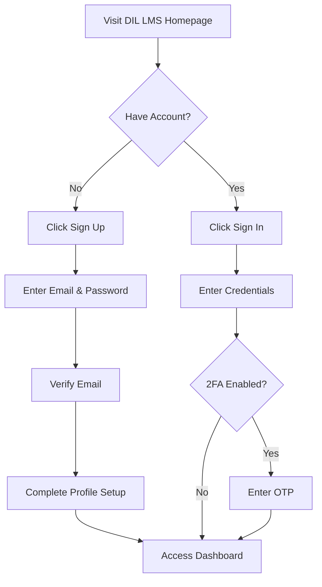
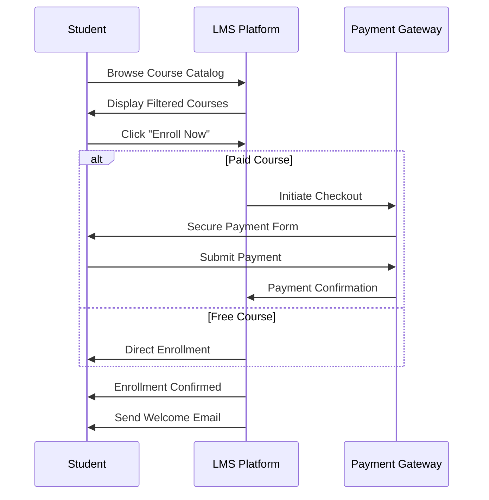
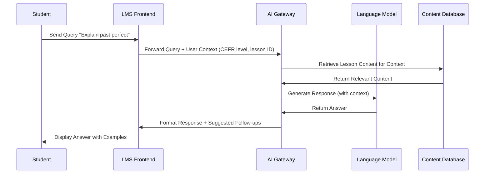

# DIL Learning Management System
## User Guide

---

### **Title Page**

**Document:** User Guide  
**Product:** DIL LMS & AI Tutor Platform  
**Version:** 1.0.0  
**Last Updated:** November 3, 2025  
**Owner:** DIL Product Team  
**Audience:** Students, Teachers, Content Creators, Admins, Super Users, View Only Users

---

### **Revision History**

| Date | Version | Editor | Reviewer | Changes |
|------|---------|--------|----------|---------|
| 2025-11-03 | 1.0.0 | Solutions Architect | Product Owner | Initial release |
| | | | | |
| | | | | |

---

## **Executive Summary**

The DIL (Development in Literacy) Learning Management System is a comprehensive educational platform designed to deliver CEFR-aligned learning experiences. This guide provides end-to-end instructions for all user roles—Students, Teachers, Content Creators, Admins, Super Users, and View Only Users.

**Key Capabilities:**
- **Adaptive Learning Paths:** CEFR-aligned curriculum with AI-powered personalization
- **AI Tutor:** Real-time conversational assistance for reading, writing, listening, and speaking practice
- **Web-Based Platform:** Responsive web portal accessible from any device with a browser
- **Role-Based Features:** Tailored interfaces for students, educators, and administrators
- **Progress Analytics:** Comprehensive dashboards with performance tracking and predictive insights
- **Secure & Compliant:** GDPR/FERPA-aware data handling with encryption and audit trails

**Document Purpose:**  
This user guide enables all stakeholders to navigate the platform effectively, troubleshoot common issues, and leverage advanced features. Each section provides step-by-step instructions, visual workflows, and safety guidelines.

**Quick Navigation:**
- **New Users:** Start with Section 3 (Getting Started)
- **Students:** Jump to Section 4.1 (Student Guide)
- **Educators:** See Section 4.2 (Teacher Guide)
- **Administrators:** Begin with Section 4.3 (Admin Guide)
- **Troubleshooting:** Skip to Section 6 (Troubleshooting & FAQs)

---

## **Table of Contents**

1. [Introduction](#1-introduction)
2. [Product Overview](#2-product-overview)  
   2.1 [User Roles & Responsibilities](#21-user-roles--responsibilities)  
   2.2 [Key Features](#22-key-features)  
   2.3 [Platform Support](#23-platform-support)  
   2.4 [Accessibility & Language Options](#24-accessibility--language-options)
3. [Getting Started](#3-getting-started)  
   3.1 [Account Creation & Sign-In](#31-account-creation--sign-in)  
   3.2 [Profile Setup](#32-profile-setup)  
   3.3 [Notification Preferences](#33-notification-preferences)  
   3.4 [Region & Time Zone](#34-region--time-zone)
4. [Role-Based User Guides](#4-role-based-user-guides)  
   4.1 [Student Guide](#41-student-guide)  
   4.2 [Teacher Guide](#42-teacher-guide)  
   4.3 [Administrator Guide](#43-administrator-guide)
5. [AI Tutor](#5-ai-tutor)  
   5.1 [How the AI Tutor Works](#51-how-the-ai-tutor-works)  
   5.2 [Safe Usage Guidelines](#52-safe-usage-guidelines)  
   5.3 [Voice vs Text Interaction](#53-voice-vs-text-interaction)  
   5.4 [Saving & Exporting Transcripts](#54-saving--exporting-transcripts)
6. [Troubleshooting & FAQs](#6-troubleshooting--faqs)  
   6.1 [Common Errors](#61-common-errors)  
   6.2 [Connectivity Issues](#62-connectivity-issues)  
   6.3 [Media Playback Problems](#63-media-playback-problems)  
   6.4 [Microphone & Camera Permissions](#64-microphone--camera-permissions)
7. [Privacy & Data Management](#7-privacy--data-management)  
   7.1 [What Data Is Stored](#71-what-data-is-stored)  
   7.2 [Data Retention Policy](#72-data-retention-policy)  
   7.3 [Requesting Data Deletion or Export](#73-requesting-data-deletion-or-export)
8. [Support & Escalation](#8-support--escalation)
9. [Glossary](#9-glossary)
10. [Appendix](#10-appendix)  
    10.1 [Keyboard Shortcuts](#101-keyboard-shortcuts)  
    10.2 [Deep Links](#102-deep-links)  
    10.3 [Known Limitations](#103-known-limitations)
11. [Stakeholder Validation Checklist](#11-stakeholder-validation-checklist)

---

## **1. Introduction**

The DIL LMS is designed to transform language learning through intelligent, adaptive technology. Whether you are a student advancing your language proficiency, a teacher designing curriculum, or an administrator managing institutional operations, this platform provides the tools you need.

**Core Philosophy:**
- **Learner-Centered:** Adaptive paths tailored to individual proficiency (A1–C2 CEFR levels)
- **AI-Augmented:** Context-aware tutoring that scales personalized support
- **Accessible:** Responsive web design accessible from any device with a browser
- **Transparent:** Real-time analytics and audit trails for accountability

---

## **2. Product Overview**

### **2.1 User Roles & Responsibilities**

| Role | Primary Responsibilities |
|------|--------------------------|
| **Student** | Enroll in courses, complete lessons, interact with AI tutor, take quizzes, track progress |
| **Teacher** | Author/curate courses, create assignments, grade submissions, provide feedback, view class analytics |
| **Content Creator** | Create and update course content, curate learning materials |
| **Admin** | Provision users, assign roles, manage course catalogs, approve content, run compliance audits |
| **Super User** | System-wide configuration, integration management, security oversight, full system access |
| **View Only** | Read-only access to course content and materials |

### **2.2 Key Features**

1. **Adaptive Learning Paths:** Dynamic content recommendations based on proficiency assessments
2. **AI Tutor:** Conversational assistant for language skills development (Listening, Reading, Writing, Speaking)
3. **Multimedia Lessons:** Video, text, interactive exercises with real-time feedback
4. **Assessment Engine:** Quizzes, assignments with auto-grading and manual grading
5. **Progress Dashboards:** Student performance analytics and goal tracking
6. **Content Authoring:** Course builder with video, text, quiz, and assignment support
7. **Collaboration Tools:** Discussion forums, live class integrations (Zoom)
8. **Security & Compliance:** Role-based access control (RBAC), data encryption, audit logs
9. **Offline Learning:** Download courses for offline access and automatic sync when online

### **2.3 Platform Support**

| Platform | Supported Versions | Notes |
|----------|-------------------|-------|
| **Web Browsers** | Chrome 90+, Firefox 88+, Safari 14+, Edge 90+ | Responsive design for desktops, tablets, and mobile browsers |
| **Screen Readers** | JAWS 2021+, NVDA 2021+, VoiceOver | WCAG 2.1 AA compliant |

### **2.4 Accessibility & Language Options**

**Accessibility Features:**
- Keyboard navigation with skip-links
- High-contrast themes (light/dark/high-contrast modes)
- Adjustable font sizes (12px–24px)
- Screen reader compatibility with ARIA labels
- Closed captions for all video content
- Alternative text for images and diagrams

**Language Support:**
- Interface Languages: English, Spanish, French, Arabic, Mandarin (expandable)
- Content Languages: Multiple languages with localized instructions
- Right-to-Left (RTL) support for Arabic and Hebrew

---

## **3. Getting Started**

### **3.1 Account Creation & Sign-In**

#### **3.1.1 Web Portal Sign-Up**

**Step 1: Navigate to Registration Page**
1. Visit `https://learn.dil.org` (replace with actual URL)
2. Click **"Sign Up"** button in top-right corner

**Step 2: Enter Registration Details**
- **Email/Password:** Enter email, create strong password (min 12 chars, uppercase, lowercase, number, symbol)



**Figure 1: User Registration & Sign-In Flow**

**Step 3: Email Verification**
- Check inbox for verification email (check spam folder if not received within 5 minutes)
- Click verification link (valid for 24 hours)
- If link expires, click "Resend Verification" on login page

**Step 4: Select User Role**
- Choose: Student, Teacher, or Admin (institutional admins assigned by Super Admin)

`[Insert Screenshot: registration-form.png – UX Team – 2025-11-10]`

---

### **3.2 Profile Setup**

#### **3.2.1 Complete Your Profile**

**Required Fields:**
1. **Full Name:** First and last name
2. **Email:** Primary contact (verified)
3. **User Role:** Student, Teacher, Admin
4. **Institution/School:** Select from dropdown (or request to add new)

**Optional Fields:**
5. **Profile Photo:** JPG/PNG, max 5 MB
6. **Date of Birth:** For age-appropriate content filtering
7. **Learning Goals:** For students (used by AI tutor for personalization)
8. **Native Language:** Helps AI tutor provide contextual explanations

`[Insert Screenshot: profile-setup-page.png – UX Team – 2025-11-10]`

#### **3.2.2 Student-Specific Setup**

**Learning Preferences:**
- **Current CEFR Level:** Self-reported (A1–C2) or set by instructor
- **Target Completion Date:** Set target date for paced study plans
- **Study Time:** Preferred daily study duration (15–120 minutes)
- **Focus Areas:** Select from Listening, Reading, Writing, Speaking

---

### **3.3 Notification Preferences**

Navigate to **Profile → Notifications** to configure:

| Notification Type | Email | In-App | Default |
|-------------------|-------|--------|---------|
| New assignment posted | ✓ | ✓ | ON |
| Grade published | ✓ | ✓ | ON |
| AI tutor daily reminder | ✓ | - | ON |
| Course enrollment confirmed | ✓ | ✓ | ON |
| System maintenance | ✓ | ✓ | ON |
| Forum mentions | ✓ | ✓ | OFF |
| Weekly progress summary | ✓ | - | ON |

**Quiet Hours:** Set "Do Not Disturb" periods (e.g., 10 PM–7 AM) to pause email notifications during specified times.

---

### **3.4 Region & Time Zone**

**Settings → Preferences:**

1. **Region:** Affects date/time formats (MM/DD/YYYY vs DD/MM/YYYY)
2. **Time Zone:** Auto-detected; adjust manually if incorrect (critical for live class scheduling)
3. **Accessibility Mode:** Enable high-contrast, large fonts, screen reader optimization

**Example:**
```
Region: North America
Time Zone: Pacific Time (UTC-8)
Date Format: MM/DD/YYYY
Time Format: 12-hour (AM/PM)
```

---

## **4. Role-Based User Guides**

### **4.1 Student Guide**

#### **4.1.1 Enroll in a Course**

**Method 1: Browse Course Catalog**
1. Navigate to **Dashboard → Course Catalog**
2. Filter by:
   - CEFR Level (A1, A2, B1, B2, C1, C2)
   - Skill Focus (Listening, Reading, Writing, Speaking, General)
   - Duration (4 weeks, 8 weeks, 12 weeks)
3. Click course card to view syllabus, instructor bio, reviews
4. Click **"Enroll Now"**
5. If course requires payment, proceed to checkout (Stripe integration)

`[Insert Screenshot: course-catalog.png – Content Team – 2025-11-10]`

**Method 2: Recommended Courses**
- Based on your CEFR level and interests, dashboard may display personalized recommendations
- Click **"Start Learning"** on recommended course cards



**Figure 2: Course Enrollment Sequence**

---

#### **4.1.2 Lesson Workflow**

**Accessing Lessons:**
1. Navigate to **My Courses → [Course Name] → Lessons**
2. Lessons unlock sequentially (linear path) or all at once (flexible path)—depends on course settings
3. Click lesson card to launch

**Lesson Structure:**
- **Pre-Lesson Quiz:** Optional diagnostic (2–5 questions)
- **Instructional Content:** Video, text, audio, interactive media
- **Practice Activities:** Exercises with instant feedback
- **AI Tutor Q&A:** Floating chat widget for clarifications
- **Post-Lesson Quiz:** Required for completion (70% pass threshold)

**Progress Tracking:**
- Green checkmark: Completed
- Yellow clock: In progress
- Gray lock: Locked (complete prerequisites first)
- Red X: Failed quiz (retry allowed)

`[Insert Screenshot: lesson-player.png – LMS Team – 2025-11-10]`

**Lesson Navigation:**
- **Next/Previous:** Arrow buttons or keyboard (Ctrl+→ / Ctrl+←)
- **Bookmarks:** Click bookmark icon to save spot; view saved bookmarks in sidebar
- **Notes:** Click note icon to add personal annotations (synced across devices)

---

#### **4.1.3 AI Tutor Chat**

**Launching AI Tutor:**
- **From Lesson:** Click floating **"Ask AI Tutor"** button (bottom-right)
- **From Dashboard:** Navigate to **AI Tutor** tab

**Conversation Modes:**
1. **Text Chat:** Type questions in natural language
2. **Voice Chat:** Click microphone icon; speak naturally (supports 50+ languages)
3. **Speaking Practice:** Request structured speaking exercises for conversation practice

**Example Interactions:**
- *"Explain the difference between 'affect' and 'effect' with examples."*
- *"Give me 5 practice sentences using present perfect tense."*
- *"Analyze my last writing essay and suggest improvements."*
- *"Let's practice a conversation on the topic of hobbies."*

**Best Practices:**
- Be specific: "Explain passive voice in essay writing" vs "Help with grammar"
- Request examples: "Show me sample opinion essay structures"
- Clarify prompts: If response is unclear, type "Can you rephrase that?"

**See Section 5 for detailed AI Tutor guidelines.**

---

#### **4.1.4 Speaking & Listening Practice**

**Listening Module:**
1. Navigate to **Skills → Listening**
2. Select exercise type:
   - **Dictation:** Listen and type what you hear
   - **Multiple Choice:** Answer comprehension questions
   - **Gap Fill:** Complete transcripts with missing words
3. Adjust playback speed (0.75×, 1×, 1.25×, 1.5×)
4. View transcript after submission (toggled on/off by teacher)

`[Insert Screenshot: listening-exercise.png – Content Team – 2025-11-10]`

**Speaking Module:**
1. Navigate to **Skills → Speaking**
2. Choose practice mode:
   - **Pronunciation Drills:** Repeat words/phrases; AI scores accuracy (0–100%)
   - **Picture Description:** Describe image within time limit
   - **Live Conversation:** Open-ended dialogue with AI tutor
3. Grant microphone permissions when prompted
4. Recordings saved automatically; review feedback in **Progress → Speaking History**

**Troubleshooting Audio:**
- **No input detected:** Check mic permissions in browser/app settings
- **Poor accuracy scores:** Reduce background noise; use headset with noise cancellation
- **Playback issues:** See Section 6.3 (Media Playback Problems)

---

#### **4.1.5 Quizzes & Assignments**

**Quiz Types:**
- **Formative Quizzes:** Practice quizzes; unlimited attempts
- **Summative Quizzes:** Graded assessments; limited attempts (typically 2)
- **Timed Quizzes:** Timed assessments with strict time limits

**Taking a Quiz:**
1. Navigate to **Course → Assessments** or click notification link
2. Review instructions and time limit
3. Click **"Start Quiz"**
4. Answer questions; progress bar shows completion
5. Click **"Submit"** (or auto-submits at time expiration)
6. View instant feedback (if enabled) or await teacher grading

**Assignment Submissions:**
1. Download assignment brief from **Assignments** tab
2. Complete work offline (Word doc, PDF, audio file, video)
3. Upload via **"Submit Assignment"** button
   - Max file size: 50 MB
   - Supported formats: PDF, DOCX, MP3, MP4, ZIP
4. Receive confirmation email upon successful submission
5. Track status: **Submitted → Under Review → Graded**

`[Insert Screenshot: quiz-interface.png – LMS Team – 2025-11-10]`

**Late Submissions:**
- Grace period: 24 hours past deadline (10% penalty)
- After grace period: Requires teacher approval to submit

---

#### **4.1.6 Progress Dashboard**

**Dashboard Widgets:**

1. **Overall Progress:** Circular progress bar showing course completion %
2. **Current CEFR Level:** Badge display (A1–C2) with confidence interval
3. **Proficiency Score:** AI-generated proficiency assessment based on recent performance
4. **Study Streak:** Days of consecutive activity (motivational gamification)
5. **Skill Breakdown:** Radar chart showing proficiency in Listening, Reading, Writing, Speaking
6. **Upcoming Deadlines:** List of assignments/quizzes due within 7 days
7. **Recent Achievements:** Badges earned (e.g., "Completed 10 Lessons," "Speaking Champion")

**Analytics Deep Dive:**
- Click **"View Detailed Analytics"** to access:
  - Time-series graph of quiz scores
  - Heatmap of study activity (days/hours)
  - Weak topic identification (automatically flagged areas for review)
  - Comparison with cohort average (anonymized)

`[Insert Screenshot: student-dashboard.png – UX Team – 2025-11-10]`

---

### **4.2 Teacher Guide**

#### **4.2.1 Create & Curate Courses**

**Course Creation Workflow:**

1. **Navigate to Teacher Portal:** **Dashboard → Courses → Create New Course**
2. **Course Basics:**
   - Title, description, thumbnail image
   - CEFR level alignment (A1–C2)
   - Skill focus tags (Listening, Reading, Writing, Speaking, Grammar, Vocabulary)
   - Duration (weeks), estimated study time per week
3. **Curriculum Builder:** Drag-and-drop interface
   - Add **Modules** (thematic units)
   - Add **Lessons** within modules
   - Add **Assessments** (quizzes, assignments)
   - Set prerequisites and unlock logic (linear vs flexible)

`[Insert Screenshot: course-builder.png – Teacher Tools Team – 2025-11-10]`

**Content Types:**
- **Video:** Upload MP4 (auto-transcoded to adaptive HLS) or embed YouTube/Vimeo
- **Text:** Rich text editor with formatting, images, embedded files
- **Audio:** MP3/WAV with playback controls
- **Interactive Exercises:** Multiple choice, fill-in-blank, drag-drop, matching
- **External Resources:** Link to PDFs and external websites

**Course Settings:**
- **Enrollment:** Open (anyone), Invitation-only, Paid
- **Pacing:** Self-paced vs Instructor-led with fixed start/end dates
- **Collaboration:** Enable forums, peer reviews, group assignments
- **AI Tutor Integration:** Allow students to query AI about course content
- **Grading Scheme:** Points-based (0–100), Pass/Fail, Letter grades (A–F)

**Publishing:**
- **Draft:** Visible only to course creator
- **Review:** Submit to School Admin for approval (if institutional policy requires)
- **Published:** Live and discoverable in catalog
- **Archived:** Inactive but accessible to previously enrolled students

---

#### **4.2.2 Assignments & Rubrics**

**Creating Assignments:**
1. Navigate to **Course → Assessments → New Assignment**
2. Configure:
   - **Title & Instructions:** Clear requirements, word count, format
   - **Due Date & Time:** Deadline with optional grace period
   - **Submission Type:** File upload, text entry, audio/video recording, URL
   - **Max File Size:** Default 50 MB (adjustable)
   - **Allow Late Submissions:** Yes/No; set penalty percentage
   - **Peer Review:** Enable for collaborative feedback

**Rubric Design:**
1. Click **"Add Rubric"** within assignment settings
2. Define **Criteria** (e.g., Content, Organization, Language Accuracy, Task Achievement)
3. For each criterion:
   - **Weight:** Percentage of total grade
   - **Levels:** Excellent, Good, Satisfactory, Needs Improvement (with point values)
   - **Descriptions:** Specific indicators for each level

**Example Rubric:**

| Criterion | Weight | Excellent (10 pts) | Good (7 pts) | Satisfactory (5 pts) | Needs Improvement (3 pts) |
|-----------|--------|-------------------|--------------|---------------------|---------------------------|
| Content | 40% | Fully addresses prompt with insightful analysis | Addresses prompt adequately | Partially addresses prompt | Misses key aspects of prompt |
| Organization | 30% | Clear structure with smooth transitions | Logical structure; minor transitions issues | Some organizational issues | Disorganized; hard to follow |
| Language | 30% | Near-native accuracy; varied vocabulary | Minor errors; good vocabulary range | Noticeable errors; limited vocabulary | Frequent errors; impedes understanding |

**Grading Interface:**
- Submissions appear in **Grading Queue** sorted by due date
- Click submission to view student work side-by-side with rubric
- Select rubric levels for each criterion; total score auto-calculates
- Add written feedback in comment box
- Attach annotated files (e.g., marked-up Word doc)
- Click **"Publish Grade"** to release to student

`[Insert Screenshot: grading-interface.png – Teacher Tools Team – 2025-11-10]`

---

#### **4.2.3 Feedback Loops**

**Types of Feedback:**

1. **Inline Comments:** Highlight text in student submissions and add contextual notes
2. **Audio Feedback:** Record voice comments (max 5 minutes) for personalized explanations
3. **Video Feedback:** Record screen + webcam for detailed walkthroughs
4. **AI-Assisted Suggestions:** LMS analyzes common errors and suggests reusable feedback templates

**Feedback Best Practices:**
- **Timeliness:** Provide feedback within 48 hours of submission (configurable reminder)
- **Specificity:** "Use more varied conjunctions (e.g., 'although,' 'whereas')" vs "Improve grammar"
- **Balance:** Highlight strengths + areas for growth
- **Actionable:** Suggest concrete next steps (e.g., "Review lesson 5 on modal verbs")

**Feedback Requests:**
- Students can reply to feedback with clarification questions
- Notifications alert teacher to student responses
- Thread preserved in assignment history

---

#### **4.2.4 Class Analytics**

**Teacher Dashboard Metrics:**

1. **Enrollment Trends:** Line graph showing enrollments over time
2. **Completion Rates:** % of students who finish course vs drop out
3. **Average Grades:** Aggregated quiz/assignment scores per module
4. **Engagement Heatmap:** Most/least accessed lessons and resources
5. **AI Tutor Usage:** Queries per student; common topics (anonymized)
6. **At-Risk Students:** Algorithm identifies students with declining performance or inactivity

**Reports:**
- **Individual Student Report:** Full transcript, grade book, attendance (for live classes)
- **Cohort Comparison:** Benchmarking across multiple class sections
- **Content Efficacy:** Correlation between lesson types and student outcomes (data-driven course improvements)

**Export Options:**
- CSV: For further analysis in Excel/Tableau
- PDF: For stakeholder presentations or accreditation reviews
- LMS API: Integrate with institutional SIS (Student Information System)

`[Insert Screenshot: teacher-analytics.png – Analytics Team – 2025-11-10]`

---

#### **4.2.5 Live Class Integration (Zoom)**

**Scheduling Live Sessions:**
1. Navigate to **Course → Live Classes → Schedule Session**
2. Configure:
   - Date, time, duration
   - Zoom Meeting ID (auto-generated or bring your own)
   - Recurring sessions (daily, weekly, custom)
   - Pre-class resources (readings, videos)
3. Click **"Create"**; invites sent automatically to enrolled students

**During Live Class:**
- **Attendance Tracking:** Students auto-marked present when they join
- **Breakout Rooms:** Managed via Zoom; assignments tracked in LMS
- **Polls & Quizzes:** Launch in-class quizzes via LMS integration
- **Recording:** Auto-uploaded to course library post-session (with consent notice)

**Post-Class:**
- Recording link appears in **Course → Recordings**
- Attendance report available in **Analytics → Live Classes**
- Students can submit questions/reflections via discussion forum

---

### **4.3 Administrator Guide**

#### **4.3.1 User Provisioning**

**Bulk User Import:**
1. Navigate to **Admin Panel → Users → Bulk Import**
2. Download CSV template
3. Populate template with user data:
   - Email, First Name, Last Name, Role (student/teacher/admin), Institution ID
4. Upload CSV; system validates data
5. Review errors/warnings; correct and re-upload
6. Click **"Confirm Import"**; welcome emails sent to new users

**Manual User Creation:**
1. Navigate to **Admin Panel → Users → Add User**
2. Fill form (email, name, role, password option: auto-generate or require user to set)
3. Click **"Create User"**

**User Lifecycle:**
- **Active:** Can sign in and access platform
- **Suspended:** Temporarily blocked (e.g., policy violation); can be reactivated
- **Deleted:** Permanently removed after 30-day retention (GDPR right to deletion)

`[Insert Screenshot: user-management.png – Admin Tools Team – 2025-11-10]`

---

#### **4.3.2 Roles & Permissions**

**Default Roles:**

| Role | Permissions |
|------|-------------|
| **Student** | Enroll in courses, submit assignments, use AI tutor, view own progress |
| **Teacher** | Create courses, grade assignments, view class analytics, schedule live classes |
| **School Admin** | User provisioning, course approvals, institutional analytics, compliance reports |
| **Super Admin** | System configuration, integration management, security audits, data backups |

**Custom Roles:**
- Navigate to **Admin Panel → Roles → Create Custom Role**
- Define granular permissions (e.g., "Content Reviewer" can approve courses but not create them)
- Assign custom roles to users via **User Management**

**Permission Matrix:**
Access full permission matrix documentation at **Admin Panel → Help → Permission Reference**.

---

#### **4.3.3 Course Catalog Management**

**Course Approval Workflow:**
1. Teacher submits course for review (status: **Pending Review**)
2. Admin receives notification in **Admin Panel → Course Approvals**
3. Admin reviews:
   - Content quality (alignment with CEFR standards)
   - Accessibility compliance (captions, alt text)
   - Policy adherence (no copyrighted material without license)
4. Admin actions:
   - **Approve:** Course published to catalog
   - **Request Changes:** Return to teacher with feedback
   - **Reject:** Course archived with explanation

**Catalog Organization:**
- Create **Categories** (e.g., Language Fundamentals, Business English, Academic Writing)
- Assign courses to categories
- Set **Featured Courses** for homepage display
- Configure **Enrollment Limits** for capacity-constrained courses

---

#### **4.3.4 Compliance & Audit Logs**

**Audit Log Access:**
- Navigate to **Admin Panel → Security → Audit Logs**
- Search/filter by:
  - **Date Range**
  - **User:** Specific user or role
  - **Action Type:** Login, data export, role change, content deletion, grade modification
  - **IP Address**
  - **Result:** Success, Failure, Partial

**Compliance Reports:**
- **FERPA Audit:** Who accessed student records and when
- **GDPR Data Requests:** Track deletion/export requests and fulfillment status
- **Content Licensing:** Report on third-party media usage and licensing status
- **Accessibility Compliance:** Scan courses for WCAG violations

**Data Retention:**
- Audit logs retained for 7 years (configurable per jurisdiction)
- Anonymized after 2 years unless flagged for investigation

`[Insert Screenshot: audit-log-viewer.png – Security Team – 2025-11-10]`

---

#### **4.3.5 System Configuration**

**Settings:** Navigate to **Admin Panel → System Settings**

**Key Configurations:**
1. **Institution Branding:**
   - Logo (SVG recommended, max 200 KB)
   - Color scheme (primary, secondary, accent)
   - Custom domain (CNAME setup instructions provided)
2. **Email Templates:**
   - Customize welcome emails, password resets, grade notifications
   - Multi-language templates
3. **API Keys:**
   - Generate keys for third-party integrations (SIS, BI tools)
   - Rotate keys quarterly (security best practice)
4. **Content Limits:**
   - Max file upload size (default 50 MB)
   - Video streaming quality (adaptive, HD-only, data-saver)
5. **AI Tutor Settings:**
   - Content filters (e.g., block off-topic discussions)
   - Data retention for chat transcripts (default 12 months)
   - Response length and detail level preferences

---

## **5. AI Tutor**

### **5.1 How the AI Tutor Works**

**Architecture Overview:**
The AI Tutor is powered by a large language model (LLM) fine-tuned on CEFR standards and language learning pedagogy. It provides:
- **Contextual Explanations:** Tailored to student's current CEFR level
- **Practice Generation:** Creates custom exercises on-demand
- **Conversational Practice:** Interactive speaking practice sessions
- **Writing Feedback:** Analyzes essays with specific improvement suggestions

**Interaction Modes:**
1. **Q&A Mode:** Ask questions about lessons, grammar, vocabulary
2. **Practice Mode:** Request exercises (e.g., "Give me 10 conditionals practice sentences")
3. **Assessment Mode:** Practice speaking/writing tasks with scoring and feedback
4. **Exploratory Mode:** Open-ended conversation for fluency practice

**Personalization:**
- AI accesses student profile (CEFR level, native language, weak areas)
- Adapts explanations (e.g., simplified grammar for A1 students)
- Remembers conversation history within session (not across sessions for privacy)



**Figure 4: AI Tutor Query Processing Flow**

---

### **5.2 Safe Usage Guidelines**

**Do's:**
- ✅ Use for clarification of course content
- ✅ Request additional practice materials
- ✅ Get alternative explanations of difficult concepts
- ✅ Practice conversational language skills (speaking fluency)
- ✅ Ask for feedback on self-assessment answers

**Don'ts:**
- ❌ **Do NOT submit graded assignment work for AI to complete** (academic integrity violation)
- ❌ **Do NOT share personal sensitive information** (address, financial data, health info)
- ❌ **Do NOT use for non-educational purposes** (e.g., chat about unrelated topics)
- ❌ **Do NOT expect AI to replace teacher** (for complex feedback, consult teacher)

**Content Filters:**
- AI will refuse to answer questions about:
  - Completing graded assignments verbatim
  - Generating full essays for submission (will guide structure instead)
  - Off-topic discussions (politics, religion, adult content)
  - Requests that violate platform policies

**Accuracy Disclaimer:**
AI-generated content is generally reliable but may occasionally contain errors. Cross-check critical information with course materials or teacher.

---

### **5.3 Voice vs Text Interaction**

**Text Chat:**
- **Pros:** Precise, easy to copy/paste examples, permanent record
- **Cons:** Slower for conversational fluency practice

**Voice Chat:**
- **Pros:** Natural speaking practice, pronunciation feedback, hands-free
- **Cons:** Requires microphone, less accurate transcription in noisy environments

**Switching Modes:**
- Click microphone icon to toggle voice input
- Click keyboard icon to return to text
- Hybrid: Speak query, AI responds with text + audio playback

**Voice Settings:**
- **Speech Rate:** Slow, Normal, Fast (adjustable in AI Tutor settings)
- **Voice Accent:** British English, American English, Australian English, Indian English
- **Background Noise Suppression:** On/Off (use On for shared spaces)

---

### **5.4 Saving & Exporting Transcripts**

**Auto-Save:**
- All AI Tutor conversations auto-saved during session
- Session ends after 30 minutes of inactivity or manual close

**Accessing Chat History:**
1. Navigate to **AI Tutor → History**
2. Browse by date or search by keyword
3. Click session to view full transcript

**Exporting Transcripts:**
1. Open chat session from history
2. Click **"Export"** button (top-right)
3. Choose format:
   - **PDF:** Formatted with timestamps
   - **TXT:** Plain text for text editors
   - **DOCX:** Editable Word document
4. File downloads immediately

**Privacy Note:**
- Transcripts stored for 12 months (configurable by admin)
- You can delete individual sessions via **History → [Session] → Delete**
- Deleted transcripts cannot be recovered

---

## **6. Troubleshooting & FAQs**

### **6.1 Common Errors**

#### **Error: "Invalid Credentials"**
**Cause:** Incorrect email/password or account locked.  
**Solution:**
1. Verify Caps Lock is OFF
2. Click **"Forgot Password?"** to reset
3. If account locked (5 failed attempts), contact support to unlock

---

#### **Error: "Session Expired"**
**Cause:** Inactivity for >2 hours or security token expired.  
**Solution:**
1. Click **"Sign In Again"** button
2. Re-enter credentials; you'll be returned to previous page
3. Unsaved work may be lost; LMS auto-saves drafts every 30 seconds for most editors

---

#### **Error: "Course Not Found"**
**Cause:** Course deleted, unpublished, or insufficient permissions.  
**Solution:**
1. Check with teacher/admin if course is still available
2. Verify you're signed in with correct account
3. Clear browser cache (Ctrl+Shift+Del) and retry

---

#### **Error: "File Upload Failed"**
**Cause:** File too large, unsupported format, or network interruption.  
**Solution:**
1. Check file size (max 50 MB default)
2. Supported formats: PDF, DOCX, MP3, MP4, ZIP, JPG, PNG
3. Try:
   - Compress file (use ZIP for large files)
   - Check internet connection
   - Try different browser (Chrome recommended)
4. If persists, contact support with error screenshot

---

### **6.2 Connectivity Issues**

**Symptom: "Cannot Load Content"**
**Diagnostic Steps:**
1. Check internet connection: Open browser, visit google.com
2. Restart router/modem
3. Try different network (switch between WiFi networks or use wired connection)
4. Disable VPN temporarily (some VPNs block media CDNs)

**Symptom: "Video Keeps Buffering"**
**Solutions:**
- Lower video quality: Click gear icon → Select 480p or 360p
- Close other tabs/apps using bandwidth
- Move closer to WiFi router
- Pause video, wait 30 seconds for buffer to load, then play

**Symptom: "Page Not Loading" (Error 500/503)**
**Meaning:** Server-side issue (not your fault).  
**Solution:**
- Wait 5 minutes, refresh page
- If persists >15 minutes, contact support

---

### **6.3 Media Playback Problems**

**Video Won't Play:**
1. **Browser Issues:**
   - Update to latest browser version
   - Enable JavaScript (required for media player)
   - Clear browser cache
2. **Codec Issues:**
   - Try different browser (Firefox, Chrome, Safari)
   - Update Adobe Flash (if legacy content; most content uses HTML5)
3. **Firewall/Proxy:**
   - Check with IT department if on corporate/school network
   - Whitelist domains: `*.dil-platform.com`, `*.cloudfront.net`

**Audio Issues:**
1. **No Sound:**
   - Check system volume (not muted)
   - Check browser tab volume icon (unmute tab)
   - Try headphones to rule out speaker issues
2. **Distorted Audio:**
   - Disable browser extensions (ad-blockers may interfere)
   - Check audio quality setting (Settings → Playback → Audio Quality)

**Subtitles Not Appearing:**
- Click **CC** button on video player
- Select language from dropdown
- If no subtitles available, report to teacher (accessibility issue)

---

### **6.4 Microphone & Camera Permissions**

**Granting Permissions (Web):**

**Chrome:**
1. Look for camera/mic icon in address bar (left of URL)
2. Click icon → Permissions
3. Set Camera/Microphone to **"Allow"**
4. Refresh page

**Firefox:**
1. Click lock icon in address bar
2. Click **"More Information" → Permissions**
3. Uncheck **"Use Default"** for Camera/Microphone
4. Select **"Allow"**

**Safari:**
1. Safari menu → Settings → Websites → Camera/Microphone
2. Find `dil-platform.com`
3. Change to **"Allow"**

**Troubleshooting:**
- **Still not working:** Restart browser
- **"Device in Use":** Close other applications using mic/camera (Zoom, Skype, etc.)
- **"Device Not Found":** Check hardware connections; try external USB mic/camera

---

### **6.5 Frequently Asked Questions (FAQs)**

**Q1: Can I use one account on multiple devices?**  
A: Yes. Sign in from multiple browsers and devices simultaneously. Progress syncs across all sessions.

**Q2: How long do I have access to a course after completion?**  
A: Lifetime access for purchased courses; institutional courses depend on enrollment period (check with admin).

**Q3: Can I download courses for offline viewing?**  
A: Yes! You can download entire courses (including videos, lessons, and content) for offline access. Navigate to **Dashboard → Offline Learning** and click **"Download"** on any enrolled course. Downloaded courses are available even when you're offline. Note: You need an internet connection to download courses initially.

**Q4: Is the AI Tutor available 24/7?**  
A: Yes, no waiting time. Note: Maintenance windows are announced via in-app notifications.

**Q5: Can I change my username/email?**  
A: Email: Yes (Profile → Account Settings → Change Email). Requires verification. Username: No (permanently linked to account).

**Q6: What if I forget my password?**  
A: Click **"Forgot Password?"** on login page → Enter email → Follow reset link (valid 1 hour).

**Q7: Can I transfer course progress to another account?**  
A: No. Progress is account-specific. Contact support for special cases (account merges require admin approval).

**Q8: Can I use the platform without a credit card?**  
A: Yes. You can access free courses without payment. Paid courses require payment via Stripe at the time of enrollment.

**Q9: How do I report a bug or suggest a feature?**  
A: Contact support via email at support@dil-platform.com or use the live chat feature (help icon in bottom-right corner). Include details about the issue or feature request. Expect response within 2 business days.

---

## **7. Privacy & Data Management**

### **7.1 What Data Is Stored**

**Personal Data:**
- Account information (name, email, hashed password)
- Profile details (date of birth, institution, phone number if provided)
- Profile photo

**Learning Data:**
- Course enrollments and progress
- Lesson completion timestamps
- Quiz/assignment responses and scores
- AI Tutor chat transcripts (text, not audio recordings stored long-term)
- Speaking practice recordings (stored 90 days for teacher review, then deleted)

**Technical Data:**
- Login timestamps, IP addresses (audit logs)
- Device information (OS, browser, app version)
- Usage analytics (anonymized aggregates)

**Payment Data:**
- Credit card: Only tokenized reference stored (actual card data held by Stripe, not DIL servers)
- Transaction history (amounts, dates)

**Third-Party Data Sharing:**
- **Analytics:** Anonymized usage data sent to Google Analytics (opt-out available)
- **AI Provider:** Prompts sent to LLM API (no PII included; sanitized queries)
- **CDN:** Media files served via AWS CloudFront (access logs retained 90 days)
- **Email Service:** AWS SES for transactional emails (addresses encrypted in transit)

---

### **7.2 Data Retention Policy**

| Data Type | Retention Period | Deletion Method |
|-----------|------------------|-----------------|
| **Active User Accounts** | Duration of enrollment + 7 years (compliance) | Soft delete (anonymized), hard delete after retention |
| **Course Progress** | Duration of enrollment + 2 years | Deleted only upon explicit user request |
| **AI Tutor Transcripts** | 12 months | Auto-deleted; user can delete earlier |
| **Speaking Recordings** | 90 days | Auto-deleted; teacher can download for longer retention |
| **Audit Logs** | 7 years | Anonymized after 2 years |
| **Payment Transactions** | 7 years (tax/legal requirements) | Archived in secure cold storage |
| **Deleted Accounts** | 30-day grace period (recovery possible) | Permanent deletion after 30 days |

---

### **7.3 Requesting Data Deletion or Export**

**GDPR/FERPA Rights:**
- **Right to Access:** Request copy of all stored data
- **Right to Deletion:** Request permanent removal (with exceptions for legal obligations)
- **Right to Portability:** Export data in machine-readable format

**How to Request:**

1. **Data Export:**
   - Navigate to **Profile → Privacy → Download My Data**
   - Click **"Request Data Export"**
   - Receive email with secure download link (valid 72 hours)
   - ZIP file contains: profile JSON, course transcripts, AI chat logs, grades CSV

2. **Account Deletion:**
   - Navigate to **Profile → Privacy → Delete Account**
   - Click **"Request Account Deletion"**
   - Confirm via email link (prevents accidental deletion)
   - 30-day grace period (can cancel deletion)
   - After 30 days: All data except anonymized analytics permanently deleted

3. **Requests for Minors:**
   - Students under 18 (or their legal guardian) can request deletion via support ticket
   - Must provide proof of guardianship if requested by guardian (scanned ID + proof of guardianship documents)
   - Processed within 30 days per COPPA/GDPR

**Exceptions:**
- Data required for legal compliance (audit logs, financial transactions) retained per retention policy
- Anonymized aggregate data (no PII) may be retained for research

**Contact for Complex Requests:**  
Email: privacy@dil-platform.com  
Subject: "GDPR/FERPA Data Request - [Your Name]"  
Response time: 10 business days

---

## **8. Support & Escalation**

**Support Channels:**

| Channel | Availability | Response Time | Best For |
|---------|-------------|---------------|----------|
| **Help Center** | 24/7 self-service | Instant | FAQs, how-to guides |
| **Live Chat** | Mon–Fri 8AM–8PM ET | <5 minutes | Quick questions |
| **Email Support** | 24/7 (monitored business hours) | <24 hours | Non-urgent issues |
| **Phone Support** | Mon–Fri 9AM–5PM ET | Immediate | Urgent account issues |
| **Community Forum** | 24/7 (peer/moderator responses) | Varies | General discussions |

**Contact Information:**
- **Email:** support@dil-platform.com
- **Phone:** +1-800-DIL-HELP (US/Canada), +44-20-XXXX-XXXX (UK) *(TODO: Insert actual numbers)*
- **Live Chat:** Available via help icon (bottom-right on all pages)

**Escalation Path:**

1. **Level 1 (Support Agent):** General troubleshooting, account resets, basic queries
2. **Level 2 (Technical Support):** API issues, integration problems, advanced troubleshooting
3. **Level 3 (Engineering):** Bug fixes, system outages, security incidents
4. **Management:** Billing disputes, policy violations, legal requests

**Critical Issues (Escalate Immediately):**
- Security breaches (suspected account hack)
- Platform-wide outages
- Data loss
- Payment errors preventing course access

**SLA (Service Level Agreement):**
- **Critical:** 1-hour response, 4-hour resolution target
- **High:** 4-hour response, 24-hour resolution target
- **Medium:** 24-hour response, 3-day resolution target
- **Low:** 48-hour response, 7-day resolution target

---

## **9. Glossary**

| Term | Definition |
|------|------------|
| **AI Tutor** | Conversational AI assistant powered by large language models (LLMs), designed to provide real-time learning assistance |
| **Assignment** | Graded task submitted by students for teacher review (essays, projects, recordings) |
| **CEFR** | Common European Framework of Reference for Languages; proficiency scale from A1 (beginner) to C2 (mastery) |
| **Cohort** | Group of students enrolled in the same course section or learning path |
| **Formative Assessment** | Practice quiz/activity not included in final grade; for learning only |
| **LMS** | Learning Management System; platform for course delivery and management |
| **Module** | Thematic unit within a course (e.g., "Academic Writing Module 1: Essays") |
| **Rubric** | Grading criteria matrix defining expectations for assignments |
| **Summative Assessment** | Graded quiz/exam contributing to final course grade |
| **Transcript** | Academic record of completed courses and grades; also refers to AI tutor conversation logs |

---

## **10. Appendix**

### **10.1 Keyboard Shortcuts**

**Video Player:**

| Action | Shortcut |
|--------|----------|
| Play/Pause | Space |
| Rewind 5 sec | ← |
| Forward 5 sec | → |
| Volume Up | ↑ |
| Volume Down | ↓ |
| Toggle Fullscreen | F |

**Note:** Video player shortcuts are standard HTML5 video controls and may vary by browser.

---

### **10.2 Deep Links**

**Direct Access URLs:**

- **My Dashboard:** `https://learn.dil.org/dashboard`
- **Profile Settings:** `https://learn.dil.org/profile-settings`
- **AI Practice:** `https://learn.dil.org/dashboard/ai-practice`
- **Specific Course:** `https://learn.dil.org/dashboard/courses/{course_id}`
- **Course Content:** `https://learn.dil.org/dashboard/courses/{course_id}/content`

**Note:** All dashboard routes require authentication (login)

---

### **10.3 Known Limitations**

**Current Known Issues (as of Nov 2025):**

1. **Safari Video Playback:**  
   *Issue:* Some HLS videos stall on Safari 14–15.  
   *Workaround:* Use Chrome or update to Safari 16+.  
   *Fix ETA:* Q1 2026

2. **AI Tutor Non-English Voice Input:**  
   *Issue:* Voice recognition accuracy <80% for languages other than English.  
   *Workaround:* Use text input for non-English queries.  
   *Fix ETA:* Ongoing ML model improvements

3. **Bulk User Import CSV Special Characters:**  
   *Issue:* Names with diacritics (ñ, é, ö) may cause import errors.  
   *Workaround:* Use UTF-8 encoded CSV files.  
   *Fix ETA:* Fixed in v2.2.5 (released)

**Feature Limitations:**

- **Max File Upload:** 50 MB
- **Concurrent Live Class Attendees:** 100 per session (Zoom plan dependent)

**Browser Support:**
- Internet Explorer: Not supported (use Edge)
- Chrome <90, Firefox <88, Safari <14: Limited functionality

---

## **11. Stakeholder Validation Checklist**

Use this checklist to validate the User Guide with stakeholders before final approval.

### **Content Completeness**

- [ ] **Executive Summary** accurately reflects product capabilities and user roles
- [ ] **Table of Contents** is complete and hyperlinked (for digital versions)
- [ ] All **user roles** (Student, Teacher, Admin, Super Admin) have dedicated sections
- [ ] **Getting Started** section covers account creation, profile setup, and preferences
- [ ] **Troubleshooting** addresses the 10 most common support tickets (validate with support team)
- [ ] **AI Tutor** usage guidelines are clear and include safety/ethical considerations
- [ ] **Privacy & Data** section complies with GDPR/FERPA requirements (legal review required)

### **Accuracy & Clarity**

- [ ] All **screenshots** placeholders have assigned owners and due dates
- [ ] **Mermaid diagrams** render correctly (test in Markdown viewer/GitHub)
- [ ] **Step-by-step instructions** tested by non-technical users (usability testing)
- [ ] **FAQs** based on actual user questions (review support ticket data)
- [ ] **Glossary** includes all domain-specific terms (CEFR, LMS, assessment terminology)
- [ ] **Keyboard shortcuts** tested on Windows, Mac, and Linux
- [ ] **Deep links** verified (all URLs return 200 OK or require login, not 404)

### **Stakeholder-Specific Validation**

**Students:**
- [ ] Course enrollment process is intuitive (max 5 steps)
- [ ] AI Tutor interaction examples are realistic and helpful
- [ ] Progress dashboard metrics are clearly explained (no confusion about scores)

**Teachers:**
- [ ] Course creation workflow matches actual UI (no outdated screenshots)
- [ ] Rubric design examples are comprehensive (cover all language skills)
- [ ] Grading interface instructions reduce teacher workload (feedback templates, bulk actions)
- [ ] Analytics section demonstrates actionable insights (not just raw data)

**Admins:**
- [ ] User provisioning (bulk import) includes error handling scenarios
- [ ] Roles & permissions matrix is audit-ready (compliance officer approved)
- [ ] Audit log access instructions meet security team requirements
- [ ] System configuration settings include change management warnings (e.g., "Changes affect all users")

### **Technical Validation**

- [ ] All **external links** tested (support email, phone numbers)
- [ ] **API integrations** (Zoom, Stripe) accurately documented (validated with engineering)
- [ ] **System requirements** match actual performance testing results
- [ ] **Known limitations** section updated with latest bug tracker data
- [ ] **Version numbers** in revision history match release tags

### **Legal & Compliance**

- [ ] **Data retention policy** reviewed by legal team (aligned with local regulations)
- [ ] **GDPR/FERPA rights** accurately described (right to access, deletion, portability)
- [ ] **Copyright notices** for third-party content (if applicable)
- [ ] **Accessibility compliance** (WCAG 2.1 AA) claims verified by accessibility audit
- [ ] **Support SLA** commitments match contract terms (no over-promising)

### **Localization Readiness**

- [ ] **Language options** list matches implemented languages (no vaporware)
- [ ] **Date/time formats** examples cover major regions (US, EU, Asia)
- [ ] **Currency** displays appropriate for target markets (if billing applicable)
- [ ] **Cultural sensitivity** check (avoid region-specific idioms or examples)

### **Final Approval**

- [ ] **Product Owner** sign-off (content aligns with product roadmap)
- [ ] **UX Team** approval (instructions match UI/UX design)
- [ ] **Support Team** review (FAQs address real user pain points)
- [ ] **Engineering** validation (technical accuracy of system behavior)
- [ ] **Legal/Compliance** clearance (privacy, data retention, accessibility)
- [ ] **Marketing** review (tone, terminology, brand consistency)

---

### **Post-Release Validation**

After document release, schedule these activities:

1. **User Testing (Week 1):**  
   - Recruit 5 users per role (student, teacher, admin)
   - Task: Complete key workflows using only this guide (no live support)
   - Measure: Time to completion, error rate, satisfaction (1–5 scale)

2. **Support Ticket Analysis (Month 1):**  
   - Flag questions answered in guide but still generating tickets
   - Update guide with clearer explanations or additional examples

3. **Quarterly Review:**  
   - Update screenshots with latest UI changes
   - Add new FAQs based on trending support topics
   - Refresh known limitations section (remove fixed bugs, add new ones)

4. **Annual Audit:**  
   - Full legal/compliance review (especially privacy section)
   - Accessibility audit for new features
   - Localization check (add newly supported languages)

---

**Document Prepared By:** Solutions Architect  
**Review Status:** Pending Stakeholder Validation  
**Next Review Date:** February 3, 2026 (Quarterly)  
**Document ID:** DIL-UG-2025-001  
**Classification:** Public (for enrolled users and prospects)

---

END OF USER GUIDE

